# I. Objetivos

- **Realizar operaciones de suavizado y de reducción de ruido en imágenes** utilizando filtros espaciales de bloque y binomiales.
- **Realizar operaciones de detección de bordes en imágenes**, tanto limpias como ruidosas, utilizando filtros basados en aproximaciones de gradientes y laplacianos, así como derivadas de primer y segundo orden de funciones Gausianas (binomiales).
- **Mejorar la nitidez de las imágenes sin ruido y con ruido** usando los filtros unsharp masking.

# II. Introducción 

Durante la realización de esta práctica  se llevó a cabo una pequeña investigación que ayuda a la compresión del tema, ya que hay muchos elementos intrínsecos que complican los cálculos matemáticos, por ello tener una buena defición ayuda a mentalizar dichos cálculos y que sea más sencillo.
$$
(f * g)(t) = \int_{-\infty}^{\infty} f(\tau)g(t - \tau) d\tau
$$
En el caso anterior definimos la operación de acuerdo a los elementos  que se lleven se logra un efecto u otro.

Esta expresión representa la convolución de las funciones (f) y (g). En términos generales, la convolución es una operación que describe cómo la forma de una función es modificada por la otra. En este caso, (f) y (g) son las dos funciones que se están convolucionando, y $\tau$ es la variable de integración. La integral se extiende desde $-\infty$ hasta $+\infty$, lo que significa que se consideran todos los posibles valores de $\tau$. 

Partimos de la idea de una convolución para  poder tomar entender lo que son los filtros

## Filtro binomial

Los coeficientes de filtro de un pedido $i$ Filtro binomial son los coeficientes que se encuentran en el $i - \text{la fila de El triángulo de Pascal}$. Los primeros filtros no normalizados $b^i$ se enumeran en el siguiente (número de sobresólido denota orden del filtro):

- $b^0 = [1]$
- $b^1 = [1, 1]$
- $b^2 = [1, 2, 1]$
- $b^3 = [1, 3, 3, 1]$​

Para generar los valores de orden es posible basarnos en el triángulo de pascal.

## Función Gaussiana y Filtros Binomiales

La función Gaussiana se aproxima discretamente mediante los filtros binomiales obtenidos a partir de la función binomial o los coeficientes del triángulo de Pascal. La función Gaussiana tiene la siguiente expresión:

$$
 f(x) = Ne^{-ax^2} 
$$

donde $N$ es una constante de normalización que depende del valor de $a$ pero no de $x$. En la forma estándar, $a = \frac{1}{2\sigma^2}$.

Los filtros binomiales se generan a partir de la función binomial o del triángulo de Pascal. La función binomial está definida como:

$$
 f_N(x) = \binom{N}{x} = \frac{N!}{x!(N-x)!} 
$$

para $x = 0, 1, ..., N$, donde $N$ es el orden del filtro deseado.

**Ejemplo 1**: Se desea diseñar un filtro en una dimensión de orden $N = 2$.

- Para $x = 0$, $f(0) = \binom{2}{0} = 1$
- Para $x = 1$, $f(1) = \binom{2}{1} = 2$
- Para $x = 2$, $f(2) = \binom{2}{2} = 1$

Por lo que el filtro en una dimensión queda:

$$
f_2(x) = [1, 2, 1]
$$

Este es un método alternativo a lo que se ha obtenido mediante el triángulo de pascal podemos comprobar el resultado de orden 2 usando el triángulo de pascal :

```
	N
	0    			1
	1			  1    1
	2    		1    2    1
	3    	1     3    3    1
	4     1     4    6    4    1 
```

Se observa que en:

```
2    		1    2    1
```

se obtiene lo mismo que:
$$
f_2(x) = [1, 2, 1]
$$

## Filtros binomiales  2D

Para poder generar el filtro de 2D dimensiones es necesario realizar el producto cruz de del filtro de 1D, en este caso lo haremos ara el filtro de orden 2.
$$
f_2(x)^T \times f_2(x) = \\
=\begin{bmatrix}1 & 2 & 1 \end{bmatrix}^T \times \begin{bmatrix}1 & 2 & 1 \end{bmatrix}=\\
=\begin{bmatrix} 1 & 2 & 1 \\ 2 & 4 & 2 \\ 1 & 2 & 1 \end{bmatrix}
$$
Sólo que normalizamos para que al valor de los puntos aledaños en total sea igual a un 100% del porcentaje original del pixel original, solo se distribuyen las cantidades, por ejemplo si solo hay valores del punto aledaño izquierdo y derecho en misma proporciones cada uno toma el 50% de la decisión del valor del pixel que esta siendo modificado, por lo que el valor es igual, al resultado de la matriz anterior multiplicada por 1/16.
$$
\frac{1}{16} \begin{bmatrix} 1 & 2 & 1 \\ 2 & 4 & 2 \\ 1 & 2 & 1 \end{bmatrix}
$$

## Filtros basados en la primera derivada de gausiana o detectores de borde

Podemos definir el nuevo punto que se esta calculando en el centro y los valores aledaños como un número menor o un número mayor en una dirección al punto que estamos calculando, ello lo hacemos para definir la derivada.

| $$f(x - 1, y - 1)$$ | $$f(x, y - 1)$$ | $$f(x + 1, y - 1)$$ |
| ------------------- | --------------- | ------------------- |
| $$f(x - 1, y)$$     | $$f(x, y)$$     | $$f(x + 1, y)$$     |
| $$f(x - 1, y + 1)$$ | $$f(x, y + 1)$$ | $$f(x + 1, y + 1)$$ |

La **derivada** de una función describe la razón de cambio instantáneo de la función en un cierto punto. 
$$
f’(x_0) = \lim_{{h \to 0}} \frac{{f(x_0 + h) - f(x_0)}}{h}
$$
Para orden discreto como son pixeles, $h=1$, es decir varia un pixel. $f(x_0)$ podemos verlo en dos dimensiones dando como resultado $f(x_0,y_o)$​, por lo que la definición de la derivada quedaría como:
$$
f’(x_0,y_o) =  f(x_0 + 1,y_o) - f(x_0,y_o)
$$
en este caso estamos definiendo una variación con respecto a $x_o$​, ya que el +1 esta en esa dirección pero podemos hacerlo con respecto a cualquier aledaño del pixel central, en pocas palabras es que tanto varia con respecto a un pixel cercano.

**Ejemplo formal de ecuación con respecto X:**
$$
\frac{\partial f(x, y)}{\partial x} \approx \nabla f(x, y) = f(x, y) - f(x-1, y) 
$$
a partir de la ecuación podemos deducir que si $x+1$ es el pixel siguiente a la derecha y $x$ el pixel central quedaría para calcular la variación como 
$$
(x+1)- (x)
$$
pero como estamos con pixeles, sería 

```
[ -1  1 ]
```


es decir el valor negativo del pixel actual (el de la izquierda), más el valor del pixel siguiente (x+1), podemos hacerlo hacia X, o con respecto a Y.

#  III. Desarrollo

## Actividad 1

Para todos los puntos siguientes, utilizar una imagen sin ruido y otra imagen con ruido. La imagen con ruido se puede generar a partir de la imagen sin ruido usando el siguiente comando de MATLAB: `J = IMNOISE(I,'TIPO')`, donde `TIPO` es una cadena que puede tomar valores 'gaussian', 'localvar', etc.

**Solución**

El ruido es un valor no deseado, por ello si ya se tiene una imagen que tiene valores establecidos, sólo se tiene que agregar un valor aleatorio a cada pixel para decir que tiene ruido con respecto a la imagen original, muestro el resultado de las dos imágenes, el código se anexa en colab.


**Figura 1: ** Imagen original generada mediante inteligencia artificial (DALL·E 3) a blanco y negro. Imagen agregándole ruido tipo **sal y pimienta**. 


## Actividad 2

Aplicar los filtros paso bajas de bloque a la imagen sin ruido y a la imagen con ruido usando filtros de orden 3x3, 5x5, 7x7 y 11x11.

**Solución**

La fórmula para crear este tipo de filtros es:
$$
M_{N \times N} = \frac{1}{N^2} 
\begin{bmatrix}
1 & \dots & 1 \\
\vdots & \ddots & \vdots \\
1 & \dots & 1_N 
\end{bmatrix}
$$
Lo que dice la anterior ecuación es que se crea una matriz $NxN$ dimensiones (cuadrada) donde todos los elementos de la matriz tienen un valor de 1, y el valor que multiplica a la matriz es 1 entre el numero de elementos de la matriz o igual a $\frac{1}{N^2}$.

Para el caso de $3x3$ es el siguiente:
$$
M_{3 \times 3} = \frac{1}{3^2} 
\begin{bmatrix}
1 & 1 & 1 \\
1 & 1 & 1 \\
1 & 1 & 1 
\end{bmatrix}
$$
Ahora resolvamos en código para automatizar en diferentes valores de N y obtenemos el siguiente resultado:


## Actividad 3

Aplicar los filtros paso bajas binomiales a la imagen sin ruido y a la imagen con ruido usando filtros de orden 3x3, 5x5, 7x7 y 11x11.

**Solución:**

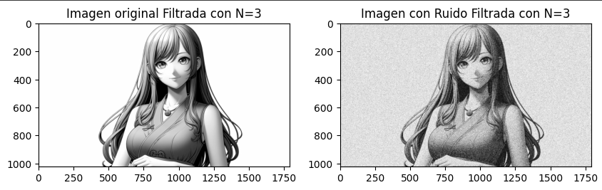

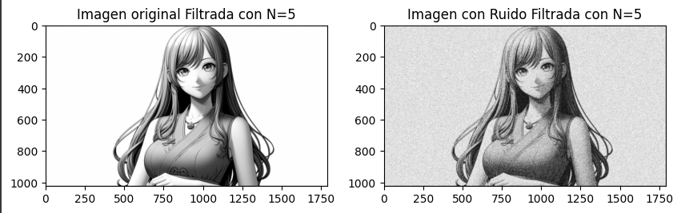


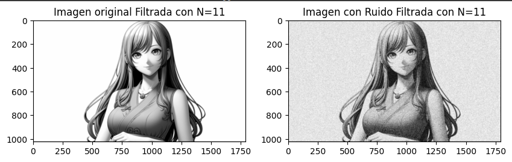

Observo un suavizado, pero no tan agresivo como en el caso anterior, y noto un mayor granulado en el caso con ruido, pero para observarlo más, lo lleve a N=15, observo mayor suavizado, pero el granulado persiste.

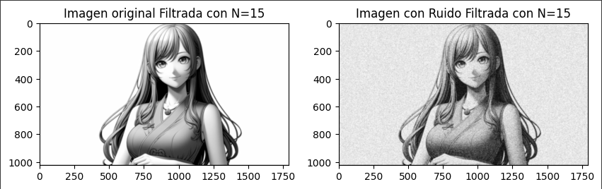

## Actividad 4

1. Aplicar a la imagen sin ruido y con ruido los filtros basados en la primera derivada de gausiana o detectores de borde siguientes:
   - De bloque `[1 -1]`.
   - Prewitt en la dirección X y en la dirección Y.
   - Sobel en la dirección X y en la dirección Y.
   - Basados en la primera derivada de Gaussiana de orden 5x5, 7x7 y 11x11.

**Solución:**

- De bloque `[1 -1]`.

Cuando decimos que el detector de borde por columnas detecta mejor los bordes verticales ello se puede apreciar en el brazo donde existe una línea vertical y esta bien definida, y en el caso de filas, cuando  hay una línea horizontal esta esta bien detectada.

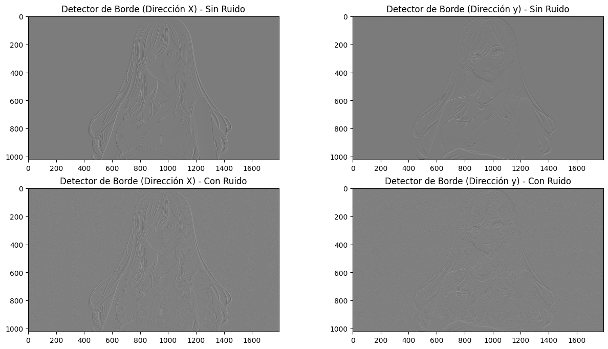

- Prewitt en la dirección X y en la dirección Y.

Se detecta mejor los bordes que con el filtro anterior.

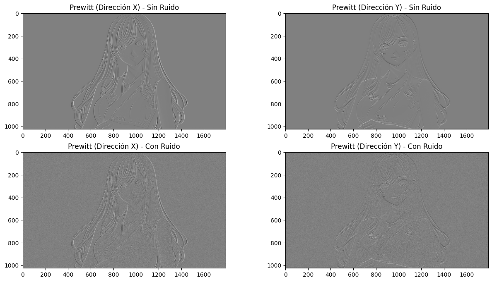

- Sobel en la dirección X y en la dirección Y.

Se podría decir que tiene una calidad igual al anterior filtro, o si existe una mejora no es muy apreciable .

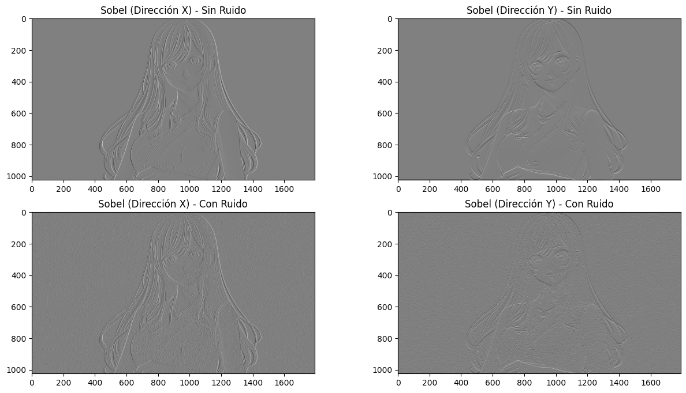

- Basados en la primera derivada de Gaussiana de orden 5x5, 7x7 y 11x11.

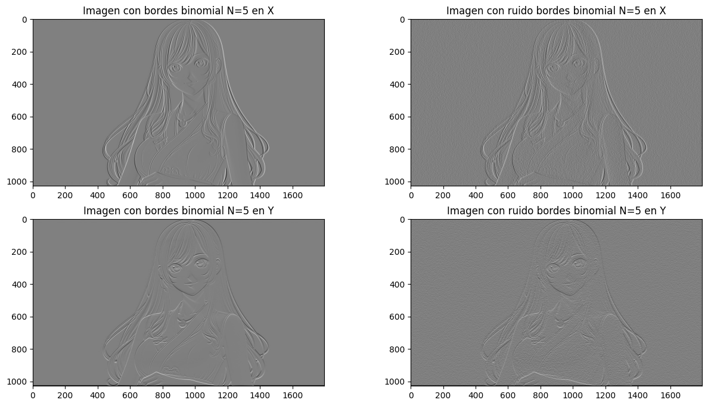

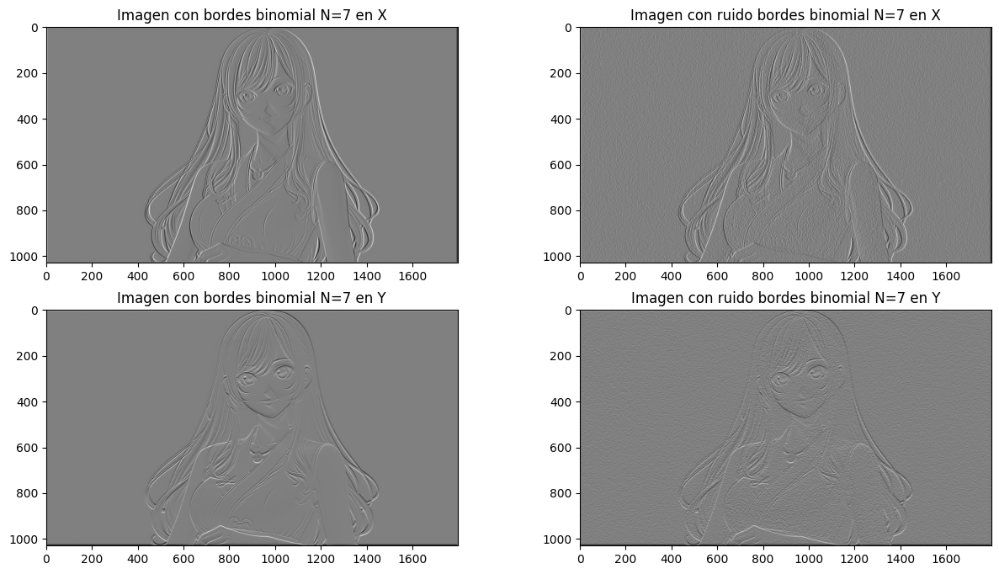

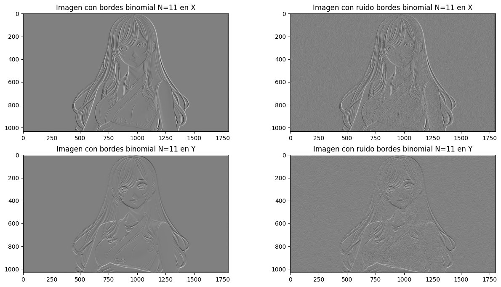

## Actividad 5

2. De igual manera, aplicar a la imagen sin ruido y a la imagen con ruido los filtros basados en la segunda derivada de gausiana siguientes:
   - Laplaciano
   
   - Basados en la segunda derivada de Gaussiana de orden 5x5, 7x7 y 11x11.

**Solución:**

- Laplaciano


- Basados en la segunda derivada de Gaussiana de orden 5x5, 7x7 y 11x11.


## Actividad 6

3. Difuminar las imágenes sin ruido y con ruido usando un filtro paso bajas de orden 5x5, de tal manera que se obtenga una imagen sin ruido y con pérdida de nitidez y otra imagen con ruido y perdida de nitidez. Para cada uno de los siguientes incisos, filtrar las imágenes utilizando el filtro unsharp masking encontrado con los siguientes tipos de filtro paso bajas:
   - Filtro paso bajas de bloque de orden 3x3 y 7x7.
   - Filtro paso bajas binomial de orden 3x3 y 7x7.

**Solución:**

- Filtro paso bajas de bloque de orden 3x3 y 7x7.

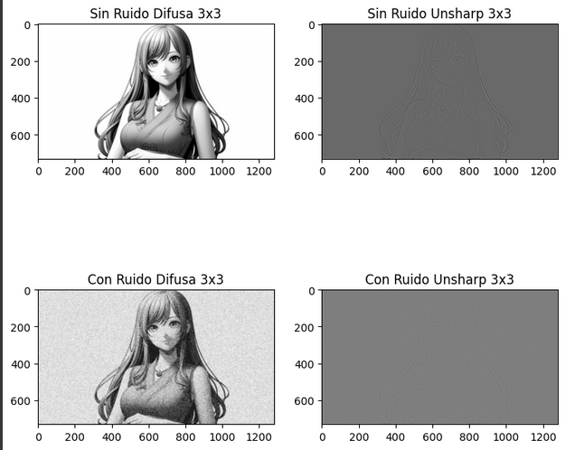

- Filtro paso bajas binomial de orden 3x3 y 7x7.
- 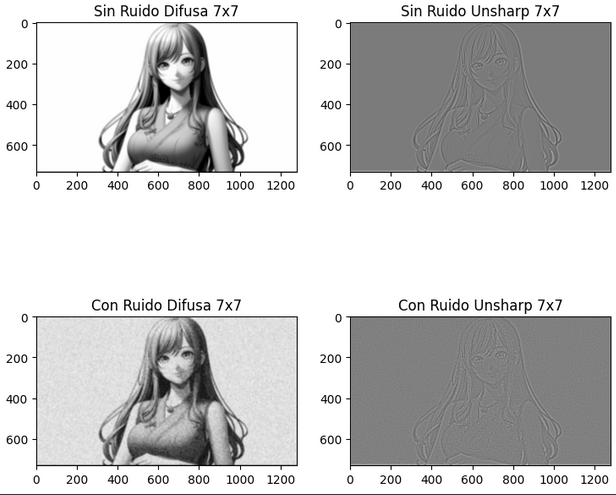

#  IV) Resultados

Si bien la aplicación de los filtros no logró un cambio total en la imagen, se completó con éxito la mayoría de ellos. No obstante, no se aprecian modificaciones significativas en la imagen final. Las razones por las que esto puede ocurrir son variadas. Una posibilidad es que la imagen original no tenga muchas texturas, lo que limita la capacidad de los filtros para modificar la apariencia de manera considerable. Otra posibilidad es que la imagen sea demasiado grande para que los filtros tengan un efecto notable. En este caso, una imagen de menor tamaño podría ser más susceptible a los cambios producidos por los filtros. Para determinar la causa exacta de la falta de cambios perceptibles, se requiere un análisis más profundo de la imagen original y de los filtros aplicados.

# V) Conclusiones:

**Barrera Peña Víctor Miguel:** Si bien la práctica fue complica, se logró un significativo avance en el termino de esta, llegando a 90% de su termino, sin embargo puede mejorarse la entrega, aunque es un buen punto, creo que que lo que falto fue entendimiento de como desarrollar los filtros de bordes y como programarlos ya que ello impidió la culminación total de la práctica.


# VI) Código Fuente

## Actividad 1

```python
from PIL import Image
import numpy as np
import matplotlib.pyplot as plt

# Leer la imagen
imagen = Image.open('anime_blanco.jpeg').convert('L')

# Convertir la imagen a una matriz
matriz_imagen = np.array(imagen)

# Mostrar la imagen
plt.imshow(matriz_imagen, cmap='gray')
plt.show()

```

```python
import random

def agregar_ruido(imagen):

    ruido = np.random.randint(-127, 127, size=imagen.shape, dtype='int8')

    # Sumar el ruido a la imagen
    imagen_con_ruido = np.clip(imagen.astype('int16') + ruido, 0, 255).astype('uint8')

    return imagen_con_ruido

imagen_ruido= agregar_ruido(matriz_imagen)

# Mostrar la imagen
plt.imshow(imagen_ruido, cmap='gray')
plt.show()
```

## Actividad 2

```python
import random

def agregar_ruido(imagen):

    ruido = np.random.randint(-127, 127, size=imagen.shape, dtype='int8')

    # Sumar el ruido a la imagen
    imagen_con_ruido = np.clip(imagen.astype('int16') + ruido, 0, 255).astype('uint8')

    return imagen_con_ruido

imagen_ruido= agregar_ruido(matriz_imagen)

# Mostrar la imagen
plt.imshow(imagen_ruido, cmap='gray')
plt.show()
```

## Actividad 3

```python
def generar_triangulo_pascal(num_filas):
    triangulo = []
    for i in range(num_filas):
        fila = [1]  # El primer número de cada fila siempre es 1
        for j in range(1, i):
            # Calculamos el número usando la fórmula nCr
            num = triangulo[i - 1][j - 1] + triangulo[i - 1][j]
            fila.append(num)
        if i > 0:
            fila.append(1)  # El último número de cada fila también es 1
        triangulo.append(fila)

    # Imprimimos el triángulo con el espaciado adecuado
    for fila in triangulo:
        espacios = " " * (num_filas - len(fila))
        print(espacios, end="")
        for num in fila:
            print(num, end=" ")
        print()

# Ejemplo: Generar el Triángulo de Pascal para 6 filas
orden=6
generar_triangulo_pascal(6)


```

```python
import numpy as np

def producto_matricial(vector1, vector2):
    """
    Calcula el producto matricial entre un vector fila y un vector columna.

    Args:
        vector1 (np.ndarray): Vector fila.
        vector2 (np.ndarray): Vector columna.

    Returns:
        np.ndarray: Matriz resultante.
    """
    # Verifica que los vectores tengan dimensiones compatibles
    if vector1.shape[0] != vector2.shape[0]:
        raise ValueError("Las dimensiones de los vectores no son compatibles para el producto matricial.")

    # Calcula el producto matricial
    matriz_resultante = np.outer(vector1, vector2)

    return matriz_resultante

# Ejemplo de uso
vector_fila = np.array([1, 2, 1])
vector_columna = np.array([1, 2, 1])

matriz_resultante = producto_matricial(vector_fila, vector_columna)
print("Matriz resultante:")
print(matriz_resultante)

```

```python
import numpy as np

def suma_y_divide(matriz):
    """
    Realiza la suma de todos los valores de una matriz y divide la matriz original por la suma.

    Args:
        matriz (np.ndarray): Matriz de entrada.

    Returns:
        np.ndarray: Matriz resultante.
    """
    # Calcula la suma de todos los valores de la matriz
    suma_total = np.sum(matriz)

    # Divide la matriz original por la suma
    matriz_resultante = matriz / suma_total

    return matriz_resultante

# Ejemplo de uso
#matriz_original = np.array([[1, 2, 3],
#                            [4, 5, 6],
#                            [7, 8, 9]])

#matriz_resultante = suma_y_divide(matriz_original)

```

implementación

```python
import numpy as np
from scipy.signal import convolve2d

N_valores=[3,5,7,11,15]

imagen = Image.open('anime_blanco.jpeg').convert('L')

# Convertir la imagen a una matriz
matriz_imagen = np.array(imagen)
imagen_ruido= agregar_ruido(matriz_imagen)


for i in N_valores:
  pascal=generar_ultimo_nivel_pascal(i)
  pascal=np.array(pascal)

  filtro2D=producto_matricial(pascal,pascal)
  filtro2D=suma_y_divide(filtro2D)
  print(filtro2D)

  # Realizar la convolución de la imagen original con la matriz de bloque
  imagen_filtrada = convolve2d(matriz_imagen, filtro2D, mode='same', boundary='fill', fillvalue=0)

  # Realizar la convolución de la imagen con ruido con la matriz de bloque
  imagen_ruido_filtrada = convolve2d(imagen_ruido, filtro2D, mode='same', boundary='fill', fillvalue=0)

  # Crear una figura con dos subplots
  fig, axs = plt.subplots(1, 2, figsize=(10, 5))

  # Mostrar la imagen filtrada en el primer subplot
  axs[0].imshow(imagen_filtrada, cmap='gray')
  axs[0].set_title('Imagen original Filtrada con N=' + str(i))

  # Mostrar la imagen con ruido filtrada en el segundo subplot
  axs[1].imshow(imagen_ruido_filtrada, cmap='gray')
  axs[1].set_title('Imagen con Ruido Filtrada con N=' + str(i))

  plt.show()


```

```python
import numpy as np
def producto_cruz(vector1):
    """
    Calcula el producto cruz de dos vectores.

    Args:
        vector1 (np.ndarray): Primer vector.
        vector2 (np.ndarray): Segundo vector.

    Returns:
        np.ndarray: Vector resultante del producto cruz.
    """
    vector1_np = np.array(vector1)
    resultado = np.cross(vector1_np,)
    return resultado

# Ejemplo de uso
vector1 = np.array([1, 2, 3])
vector2 = np.array([4, 5, 6])

resultado_producto_cruz = producto_cruz(vector1, vector2)
print("Producto cruz:", resultado_producto_cruz)

```

## Actividad 4

```python
import numpy as np
from scipy.signal import convolve2d
import matplotlib.pyplot as plt

# Definir las matrices de filtro para los detectores de borde
filtro_columnas = np.array([[1, -1]])
filtro_filas = np.array([[1], [-1]])

# Aplicar los filtros a la imagen sin ruido y con ruido
imagen_sin_ruido_borde_columnas = convolve2d(matriz_imagen, filtro_columnas, mode='same', boundary='fill', fillvalue=0)
imagen_sin_ruido_borde_filas = convolve2d(matriz_imagen, filtro_filas, mode='same', boundary='fill', fillvalue=0)

imagen_con_ruido_borde_columnas = convolve2d(imagen_ruido, filtro_columnas, mode='same', boundary='fill', fillvalue=0)
imagen_con_ruido_borde_filas = convolve2d(imagen_ruido, filtro_filas, mode='same', boundary='fill', fillvalue=0)

# Mostrar las imágenes resultantes
fig, axs = plt.subplots(2, 2, figsize=(15, 8))

# Imagen sin ruido - Detector de borde en columnas
axs[0, 0].imshow(imagen_sin_ruido_borde_columnas, cmap='gray')
axs[0, 0].set_title('Detector de Borde (Dirección X) - Sin Ruido')

# Imagen sin ruido - Detector de borde en filas
axs[0, 1].imshow(imagen_sin_ruido_borde_filas, cmap='gray')
axs[0, 1].set_title('Detector de Borde (Dirección y) - Sin Ruido')

# Imagen con ruido - Detector de borde en columnas
axs[1, 0].imshow(imagen_con_ruido_borde_columnas, cmap='gray')
axs[1, 0].set_title('Detector de Borde (Dirección X) - Con Ruido')

# Imagen con ruido - Detector de borde en filas
axs[1, 1].imshow(imagen_con_ruido_borde_filas, cmap='gray')
axs[1, 1].set_title('Detector de Borde (Dirección y) - Con Ruido')

plt.show()

```

```python
import numpy as np
from scipy.signal import convolve2d
import matplotlib.pyplot as plt

# Definir las matrices de filtro para Prewitt en dirección X e Y
filtro_prewitt_x = np.array([[1, 0, -1],
                             [1, 0, -1],
                             [1, 0, -1]])

filtro_prewitt_y = np.array([[1, 1, 1],
                             [0, 0, 0],
                             [-1, -1, -1]])

# Aplicar los filtros a la imagen sin ruido y con ruido
imagen_sin_ruido_prewitt_x = convolve2d(matriz_imagen, filtro_prewitt_x, mode='same', boundary='fill', fillvalue=0)
imagen_sin_ruido_prewitt_y = convolve2d(matriz_imagen, filtro_prewitt_y, mode='same', boundary='fill', fillvalue=0)

imagen_con_ruido_prewitt_x = convolve2d(imagen_ruido, filtro_prewitt_x, mode='same', boundary='fill', fillvalue=0)
imagen_con_ruido_prewitt_y = convolve2d(imagen_ruido, filtro_prewitt_y, mode='same', boundary='fill', fillvalue=0)

# Mostrar las imágenes resultantes
fig, axs = plt.subplots(2, 2, figsize=(15, 8))

# Imagen sin ruido - Prewitt en dirección X
axs[0, 0].imshow(imagen_sin_ruido_prewitt_x, cmap='gray')
axs[0, 0].set_title('Prewitt (Dirección X) - Sin Ruido')

# Imagen sin ruido - Prewitt en dirección Y
axs[0, 1].imshow(imagen_sin_ruido_prewitt_y, cmap='gray')
axs[0, 1].set_title('Prewitt (Dirección Y) - Sin Ruido')

# Imagen con ruido - Prewitt en dirección X
axs[1, 0].imshow(imagen_con_ruido_prewitt_x, cmap='gray')
axs[1, 0].set_title('Prewitt (Dirección X) - Con Ruido')

# Imagen con ruido - Prewitt en dirección Y
axs[1, 1].imshow(imagen_con_ruido_prewitt_y, cmap='gray')
axs[1, 1].set_title('Prewitt (Dirección Y) - Con Ruido')

plt.show()

```

```python
import numpy as np
from scipy.signal import convolve2d
import matplotlib.pyplot as plt

# Definir las matrices de filtro para Sobel en dirección X e Y
filtro_sobel_x = np.array([[1, 0, -1],
                           [2, 0, -2],
                           [1, 0, -1]])

filtro_sobel_y = np.array([[1, 2, 1],
                           [0, 0, 0],
                           [-1, -2, -1]])

# Aplicar los filtros a la imagen sin ruido y con ruido
imagen_sin_ruido_sobel_x = convolve2d(matriz_imagen, filtro_sobel_x, mode='same', boundary='fill', fillvalue=0)
imagen_sin_ruido_sobel_y = convolve2d(matriz_imagen, filtro_sobel_y, mode='same', boundary='fill', fillvalue=0)

imagen_con_ruido_sobel_x = convolve2d(imagen_ruido, filtro_sobel_x, mode='same', boundary='fill', fillvalue=0)
imagen_con_ruido_sobel_y = convolve2d(imagen_ruido, filtro_sobel_y, mode='same', boundary='fill', fillvalue=0)

# Mostrar las imágenes resultantes
fig, axs = plt.subplots(2, 2, figsize=(15, 8))

# Imagen sin ruido - Sobel en dirección X
axs[0, 0].imshow(imagen_sin_ruido_sobel_x, cmap='gray')
axs[0, 0].set_title('Sobel (Dirección X) - Sin Ruido')

# Imagen sin ruido - Sobel en dirección Y
axs[0, 1].imshow(imagen_sin_ruido_sobel_y, cmap='gray')
axs[0, 1].set_title('Sobel (Dirección Y) - Sin Ruido')

# Imagen con ruido - Sobel en dirección X
axs[1, 0].imshow(imagen_con_ruido_sobel_x, cmap='gray')
axs[1, 0].set_title('Sobel (Dirección X) - Con Ruido')

# Imagen con ruido - Sobel en dirección Y
axs[1, 1].imshow(imagen_con_ruido_sobel_y, cmap='gray')
axs[1, 1].set_title('Sobel (Dirección Y) - Con Ruido')

plt.show()

```

solución

```python
import numpy as np
from scipy.signal import convolve2d
import matplotlib.pyplot as plt

def generar_vector_binomial(r, n):
    if r == 0:
        return np.array([1])
    else:
        prev_vector = generar_vector_binomial(r - 1, n)
        return np.convolve(prev_vector, np.array([1, -1])) * (n - r + 1) / r

def generar_matriz_derivada_gaussiana_1d(n):
    vector_x = generar_vector_binomial(0, n)
    vector_y = generar_vector_binomial(1, n)
    return np.outer(vector_y, vector_x)

# Tamaños de las matrices de derivada de Gaussiana
tamanos = [5, 7, 11]

# Generar y mostrar las matrices para los diferentes tamaños
for tamano in tamanos:
    matriz_derivada_gaussiana_x = generar_matriz_derivada_gaussiana_1d(tamano)
    matriz_derivada_gaussiana_y = generar_matriz_derivada_gaussiana_1d(tamano).T

    # Aplicar los filtros a la imagen sin ruido y con ruido
    imagen_sin_ruido_gaussiana_x = convolve2d(matriz_imagen, matriz_derivada_gaussiana_x, mode='same', boundary='fill', fillvalue=0)
    imagen_sin_ruido_gaussiana_y = convolve2d(matriz_imagen, matriz_derivada_gaussiana_y, mode='same', boundary='fill', fillvalue=0)

    imagen_con_ruido_gaussiana_x = convolve2d(imagen_ruido, matriz_derivada_gaussiana_x, mode='same', boundary='fill', fillvalue=0)
    imagen_con_ruido_gaussiana_y = convolve2d(imagen_ruido, matriz_derivada_gaussiana_y, mode='same', boundary='fill', fillvalue=0)

    # Mostrar las imágenes resultantes
    fig, axs = plt.subplots(2, 2, figsize=(10, 8))

    # Imagen sin ruido - Primera derivada de Gaussiana en dirección X
    axs[0, 0].imshow(imagen_sin_ruido_gaussiana_x, cmap='gray')
    axs[0, 0].set_title(f'Gaussiana (Dirección X) {tamano}x{tamano} - Sin Ruido')

    # Imagen sin ruido - Primera derivada de Gaussiana en dirección Y
    axs[0, 1].imshow(imagen_sin_ruido_gaussiana_y, cmap='gray')
    axs[0, 1].set_title(f'Gaussiana (Dirección Y) {tamano}x{tamano} - Sin Ruido')

    # Imagen con ruido - Primera derivada de Gaussiana en dirección X
    axs[1, 0].imshow(imagen_con_ruido_gaussiana_x, cmap='gray')
    axs[1, 0].set_title(f'Gaussiana (Dirección X) {tamano}x{tamano} - Con Ruido')

    # Imagen con ruido - Primera derivada de Gaussiana en dirección Y
    axs[1, 1].imshow(imagen_con_ruido_gaussiana_y, cmap='gray')
    axs[1, 1].set_title(f'Gaussiana (Dirección Y) {tamano}x{tamano} - Con Ruido')

    plt.show()

```

## Actividad 4

laplaciano 3

```python
import numpy as np
from scipy.signal import convolve2d
import matplotlib.pyplot as plt

# Definir el filtro Laplaciano
filtro_laplaciano = np.array([[-1, -1, -1],
                              [-1, 8, -1],
                              [-1, -1, -1]])


# Aplicar el filtro Laplaciano a la imagen sin ruido
imagen_sin_ruido_laplaciano = convolve2d(matriz_imagen, filtro_laplaciano, mode='same', boundary='fill', fillvalue=0)

# Aplicar el filtro Laplaciano a la imagen con ruido
imagen_con_ruido_laplaciano = convolve2d(imagen_ruido, filtro_laplaciano, mode='same', boundary='fill', fillvalue=0)

# Mostrar las imágenes resultantes
fig, axs = plt.subplots(1, 2, figsize=(10, 5))

# Imagen sin ruido con filtro Laplaciano
axs[0].imshow(imagen_sin_ruido_laplaciano, cmap='gray')
axs[0].set_title('Laplaciano')

# Imagen con ruido con filtro Laplaciano
axs[1].imshow(imagen_con_ruido_laplaciano, cmap='gray')
axs[1].set_title('Laplaciano - Con Ruido')

plt.show()

```

implementación

```python
import numpy as np
from scipy.signal import convolve2d
import matplotlib.pyplot as plt

# Función para generar un filtro de segunda derivada de Gaussiana
def generar_filtro_segunda_derivada_gaussiana(n):
    x = np.arange(-n//2 + 1., n//2 + 1.)
    y = np.arange(-n//2 + 1., n//2 + 1.)
    xx, yy = np.meshgrid(x, y)
    kernel = (1/(2*np.pi)) * (1 - (xx**2 + yy**2) / (2 * (n/2)**2)) * np.exp(-(xx**2 + yy**2) / (2 * (n/2)**2))
    return kernel

# Tamaños de los filtros de segunda derivada de Gaussiana
tamanos_filtros = [5, 7, 11]

# Aplicar los filtros a la imagen sin ruido y con ruido
for tamano in tamanos_filtros:
    print(f"Tamaño del filtro de segunda derivada de Gaussiana: {tamano}x{tamano}")
    # Generar el filtro de segunda derivada de Gaussiana
    filtro_segunda_derivada_gaussiana = generar_filtro_segunda_derivada_gaussiana(tamano)

    # Aplicar el filtro a la imagen sin ruido
    imagen_sin_ruido_segunda_derivada = convolve2d(matriz_imagen, filtro_segunda_derivada_gaussiana, mode='same', boundary='fill', fillvalue=0)

    # Aplicar el filtro a la imagen con ruido
    imagen_con_ruido_segunda_derivada = convolve2d(imagen_ruido, filtro_segunda_derivada_gaussiana, mode='same', boundary='fill', fillvalue=0)

    # Mostrar las imágenes resultantes
    fig, axs = plt.subplots(1, 2, figsize=(10, 5))

    # Imagen sin ruido con filtro de segunda derivada de Gaussiana
    axs[0].imshow(imagen_sin_ruido_segunda_derivada, cmap='gray')
    axs[0].set_title(f'Segunda Derivada Gaussiana {tamano}x{tamano} - Sin Ruido')

    # Imagen con ruido con filtro de segunda derivada de Gaussiana
    axs[1].imshow(imagen_con_ruido_segunda_derivada, cmap='gray')
    axs[1].set_title(f'Segunda Derivada Gaussiana {tamano}x{tamano} - Con Ruido')

    plt.show()

```

## Actividad 6

```python
import numpy as np
from scipy.signal import convolve2d
from scipy.ndimage import gaussian_filter
import matplotlib.pyplot as plt

# Función para generar un filtro paso bajo de bloque de orden 3x3 y 7x7
def generar_filtro_bloque(tamano):
    return np.ones((tamano, tamano)) / (tamano * tamano)

# Función para generar un filtro de segunda derivada de Gaussiana
def generar_filtro_segunda_derivada_gaussiana(n):
    x = np.arange(-n//2 + 1., n//2 + 1.)
    y = np.arange(-n//2 + 1., n//2 + 1.)
    xx, yy = np.meshgrid(x, y)
    kernel = (1/(2*np.pi)) * (1 - (xx**2 + yy**2) / (2 * (n/2)**2)) * np.exp(-(xx**2 + yy**2) / (2 * (n/2)**2))
    return kernel

# Difuminar las imágenes sin ruido y con ruido usando un filtro paso bajo de orden 5x5
imagen_sin_ruido_difusa = gaussian_filter(matriz_imagen, sigma=1)
imagen_con_ruido_difusa = gaussian_filter(imagen_ruido, sigma=1)

# Definir filtros paso bajo de bloque de orden 3x3 y 7x7
filtro_bloque_3x3 = generar_filtro_bloque(3)
filtro_bloque_7x7 = generar_filtro_bloque(7)

# Aplicar unsharp masking a las imágenes sin ruido difusas
imagen_sin_ruido_unsharp_3x3 = matriz_imagen - convolve2d(matriz_imagen, filtro_bloque_3x3, mode='same', boundary='fill', fillvalue=0)
imagen_sin_ruido_unsharp_7x7 = matriz_imagen - convolve2d(matriz_imagen, filtro_bloque_7x7, mode='same', boundary='fill', fillvalue=0)

# Aplicar unsharp masking a las imágenes con ruido difusas
imagen_con_ruido_unsharp_3x3 = imagen_ruido - convolve2d(imagen_ruido, filtro_bloque_3x3, mode='same', boundary='fill', fillvalue=0)
imagen_con_ruido_unsharp_7x7 = imagen_ruido - convolve2d(imagen_ruido, filtro_bloque_7x7, mode='same', boundary='fill', fillvalue=0)

# Mostrar las imágenes difusas y con unsharp masking
fig, axs = plt.subplots(2, 3, figsize=(15, 8))

axs[0, 0].imshow(imagen_sin_ruido_difusa, cmap='gray')
axs[0, 0].set_title('Sin Ruido Difusa')

axs[0, 1].imshow(imagen_sin_ruido_unsharp_3x3, cmap='gray')
axs[0, 1].set_title('Sin Ruido Unsharp 3x3')

axs[0, 2].imshow(imagen_sin_ruido_unsharp_7x7, cmap='gray')
axs[0, 2].set_title('Sin Ruido Unsharp 7x7')

axs[1, 0].imshow(imagen_con_ruido_difusa, cmap='gray')
axs[1, 0].set_title('Con Ruido Difusa')

axs[1, 1].imshow(imagen_con_ruido_unsharp_3x3, cmap='gray')
axs[1, 1].set_title('Con Ruido Unsharp 3x3')

axs[1, 2].imshow(imagen_con_ruido_unsharp_7x7, cmap='gray')
axs[1, 2].set_title('Con Ruido Unsharp 7x7')

plt.tight_layout()
plt.show()

```


# VIII) Bibliografía /Referencias:

1. **Freeman, W. T., & Adelson, E. H. (1991). The design and use of steerable filters.** IEEE Transactions on Pattern Analysis and Machine Intelligence, 13(9), 891-906.

2. **Gómez, W. (n.d.). Clase 05: Procesamiento de imágenes digitales.** Departamento de Computación, CICESE. Recuperado el 21 de marzo de 2024, de [https://www.tamps.cinvestav.mx/~wgomez/diapositivas/AID/Clase05.pdf](https://www.tamps.cinvestav.mx/~wgomez/diapositivas/AID/Clase05.pdf)

3. **[Video de YouTube]. (2015, octubre 14). Filtro Laplaciano - OpenCV.** [Video]. YouTube. Recuperado el 21 de marzo de 2024, de [https://www.youtube.com/watch?v=FXC27X9eQO8](https://www.youtube.com/watch?v=FXC27X9eQO8)

4. **Laboratorio de Procesamiento de Imágenes y Análisis de Patrones (LAP). (n.d.). Realce de la imagen.** Facultad de Ingeniería, UNAM. Recuperado el 21 de marzo de 2024, de [http://lapi.fi-p.unam.mx/wp-content/uploads/PDI_Cap4_Realce-de-la-Imagen.pdf](http://lapi.fi-p.unam.mx/wp-content/uploads/PDI_Cap4_Realce-de-la-Imagen.pdf)

5. **Lindsay, J. B. (n.d.). Filter Laplacian.** Whitebox. Recuperado el 21 de marzo de 2024, de [https://jblindsay.github.io/ghrg/Whitebox/Help/FilterLaplacian.html](https://jblindsay.github.io/ghrg/Whitebox/Help/FilterLaplacian.html)

6. **NCEI.Monitoring.Info@noaa.gov. (s. f.). Did You Know? | National Centers for Environmental Information (NCEI).** [https://www.ncei.noaa.gov/access/monitoring/dyk/binomial-filter](https://www.ncei.noaa.gov/access/monitoring/dyk/binomial-filter)

7. **Pérez, P. (n.d.). Filtro Gaussiano y derivados de Gaussiano.** Facultad de Matemática, Astronomía, Física y Computación, UNC. Recuperado el 21 de marzo de 2024, de [https://www.famaf.unc.edu.ar/~pperez1/manuales/cim/cap4.html](https://www.famaf.unc.edu.ar/~pperez1/manuales/cim/cap4.html)

8. **[Python] Cómo calcular el producto vectorial - Okpedia. (2021, 20 septiembre).** [https://how.okpedia.org/es/python/como-calcular-el-producto-vectorial-en-python](https://how.okpedia.org/es/python/como-calcular-el-producto-vectorial-en-python)

9. **[Python] Cómo hacer una matriz transpuesta - Okpedia. (2019, 17 abril).** [https://how.okpedia.org/es/python/como-hacer-una-matriz-transpuesta-en-python](https://how.okpedia.org/es/python/como-hacer-una-matriz-transpuesta-en-python)

10. **Procesamiento de imágenes con derivadas - Detección de esquinas y bordes — documentación de Curso de imágenes médicas - 1.0. (s. f.).** [https://www.famaf.unc.edu.ar/~pperez1/manuales/cim/cap4.html](https://www.famaf.unc.edu.ar/~pperez1/manuales/cim/cap4.html)

11. **Rodríguez-Hernández, J. A. (2010). Diseño e implementación de un sistema de detección de objetos basado en el filtro de Gabor.** Universidad de las Ciencias Informáticas. Recuperado el 21 de marzo de 2024, de [https://repositorio.uci.cu/jspui/bitstream/ident/TD_03542_10/1/TD_03542_10.pdf](https://repositorio.uci.cu/jspui/bitstream/ident/TD_03542_10/1/TD_03542_10.pdf)

12. **Scheidl, H. (2021)1. Filtros binomiales.** Recuperado de [https://githubharald.github.io/binomial_filters.html](https://githubharald.github.io/binomial_filters.html). Fecha de acceso: 21 de marzo de 2024.
