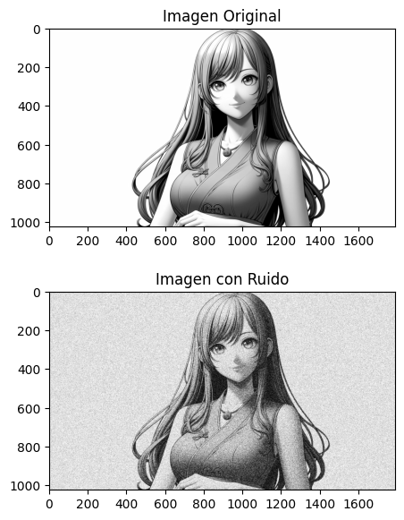
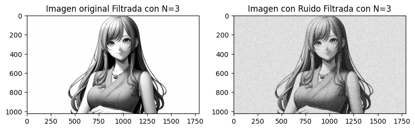
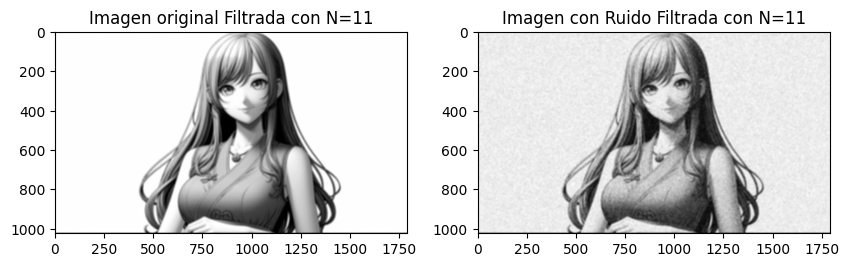

# I. Objetivos

- **Realizar operaciones de suavizado y de reducción de ruido en imágenes** utilizando filtros espaciales de bloque y binomiales.
- **Realizar operaciones de detección de bordes en imágenes**, tanto limpias como ruidosas, utilizando filtros basados en aproximaciones de gradientes y laplacianos, así como derivadas de primer y segundo orden de funciones Gausianas (binomiales).
- **Mejorar la nitidez de las imágenes sin ruido y con ruido** usando los filtros unsharp masking.

# II. Introducción 

Durante la realización de esta práctica  se llevó a cabo una pequeña investigación que ayuda a la compresión del tema, ya que hay muchos elementos intrínsecos que complican los cálculos matemáticos, por ello tener una buena defición ayuda a mentalizar dichos cálculos y que sea más sencillo.
$$
(f * g)(t) = \int_{-\infty}^{\infty} f(\tau)g(t - \tau) d\tau
$$
En el caso anterior definimos la operación de acuerdo a los elementos  que se lleven se logra un efecto u otro.

Esta expresión representa la convolución de las funciones (f) y (g). En términos generales, la convolución es una operación que describe cómo la forma de una función es modificada por la otra. En este caso, (f) y (g) son las dos funciones que se están convolucionando, y $\tau$ es la variable de integración. La integral se extiende desde $-\infty$ hasta $+\infty$, lo que significa que se consideran todos los posibles valores de $\tau$. 

Partimos de la idea de una convolución para  poder tomar entender lo que son los filtros

#  III. Desarrollo

## Actividad 1

Para todos los puntos siguientes, utilizar una imagen sin ruido y otra imagen con ruido. La imagen con ruido se puede generar a partir de la imagen sin ruido usando el siguiente comando de MATLAB: `J = IMNOISE(I,'TIPO')`, donde `TIPO` es una cadena que puede tomar valores 'gaussian', 'localvar', etc.

**Solución**

El ruido es un valor no deseado, por ello si ya se tiene una imagen que tiene valores establecidos, sólo se tiene que agregar un valor aleatorio a cada pixel para decir que tiene ruido con respecto a la imagen original, muestro el resultado de las dos imágenes, el código se anexa en colab.

## Actividad 2

Aplicar los filtros paso bajas de bloque a la imagen sin ruido y a la imagen con ruido usando filtros de orden 3x3, 5x5, 7x7 y 11x11.

**Solución**

La fórmula para crear este tipo de filtros es:
$$
M_{N \times N} = \frac{1}{N^2} 
\begin{bmatrix}
1 & \dots & 1 \\
\vdots & \ddots & \vdots \\
1 & \dots & 1_N 
\end{bmatrix}
$$
Lo que dice la anterior ecuación es que se crea una matriz $NxN$ dimensiones (cuadrada) donde todos los elementos de la matriz tienen un valor de 1, y el valor que multiplica a la matriz es 1 entre el numero de elementos de la matriz o igual a $\frac{1}{N^2}$.

Para el caso de $3x3$ es el siguiente:
$$
M_{3 \times 3} = \frac{1}{3^2} 
\begin{bmatrix}
1 & 1 & 1 \\
1 & 1 & 1 \\
1 & 1 & 1 
\end{bmatrix}
$$
Ahora resolvamos en código para automatizar en diferentes valores de N y obtenemos el siguiente resultado:

## Actividad 3

Aplicar los filtros paso bajas binomiales a la imagen sin ruido y a la imagen con ruido usando filtros de orden 3x3, 5x5, 7x7 y 11x11.

**Solución:**

## Actividad 4

1. Aplicar a la imagen sin ruido y con ruido los filtros basados en la primera derivada de gausiana o detectores de borde siguientes:
   - De bloque `[1 -1]`.
   - Prewitt en la dirección X y en la dirección Y.
   - Sobel en la dirección X y en la dirección Y.
   - Basados en la primera derivada de Gaussiana de orden 5x5, 7x7 y 11x11.

## Actividad 5

2. De igual manera, aplicar a la imagen sin ruido y a la imagen con ruido los filtros basados en la segunda derivada de gausiana siguientes:
   - Laplaciano
   - Basados en la segunda derivada de Gaussiana de orden 5x5, 7x7 y 11x11.

## Actividad 6

3. Difuminar las imágenes sin ruido y con ruido usando un filtro paso bajas de orden 5x5, de tal manera que se obtenga una imagen sin ruido y con pérdida de nitidez y otra imagen con ruido y perdida de nitidez. Para cada uno de los siguientes incisos, filtrar las imágenes utilizando el filtro unsharp masking encontrado con los siguientes tipos de filtro paso bajas:
   - Filtro paso bajas de bloque de orden 3x3 y 7x7.
   - Filtro paso bajas binomial de orden 3x3 y 7x7.

​              

> 

# DESARROLLO

.

#  Resultados

# Conclusiones:

# Codigo Fuente

#  {#section .unnumbered}

# Bibliografía

# Referencia:

-   https://www.tamps.cinvestav.mx/~wgomez/diapositivas/AID/Clase04.pdf
-   http://ri.uaemex.mx/bitstream/handle/20.500.11799/108401/secme-37094_1.pdf?sequence=1&isAllowed=y
-   [digital_image_filtering (fmwconcepts.com)](http://www.fmwconcepts.com/imagemagick/digital_image_filtering.pdf)
-   [PDI_Cap4_Realce-de-la-Imagen.pdf (unam.mx)](http://lapi.fi-p.unam.mx/wp-content/uploads/PDI_Cap4_Realce-de-la-Imagen.pdf)
-   [Filtrado espacial de imágenes |  | UPV (youtube.com)](https://www.youtube.com/watch?v=X88MfPRtvoA)
-   [Practica4.pdf (unam.mx)](http://lapi.fi-p.unam.mx/wp-content/uploads/Practica4.pdf)
-   https://www.tec.ac.cr/sites/default/files/media/doc/lec05.2.pdf
