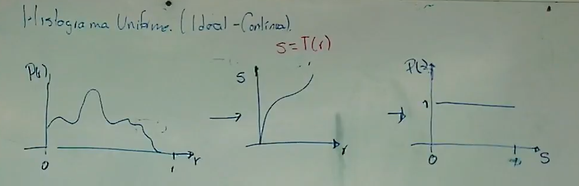

```
Tarea 4
Barrera Peña Víctor  Miguel
Clase (Procesamiento digital de imágenes)
Universidad Nacional Autónoma de México (UNAM),
Ciudad de México, México
tareas.victor.miguel.barrera.pena@gmail.com
Fecha entrega: 02/04/2024
```

# Actividad

Realice la ecualización de las 2 funciones que se muestran en la figura.
NOTA: Para que se califique la tarea debe incluir todo el desglose matemático, así como llegar hasta el resultado final.


# Teoría (Clase)

Las siguientes fotos son tomadas de la clase presencial de la materia:

Bajo contraste


alto contraste: Se distribuye más uniforme en el histograma.


 


Se realiza una transformación para convertir el histograma $P(r)$ al ideal con la transformación $t(r)$




# Solución

## Problema A

Lo primero es obtener las ecuaciones que representen la gráfica


Se tiene que realizar en dos partes, la primera de 0 a $\frac{1}{2}$ y la siguiente  $\frac{1}{2}$ a $R$​, obteniendo las siguientes dos ecuaciones


Como siguiente paso 
$$
\left. 
	\int_0^{r} 4w dw \hspace{2.5cm} 0 \leq r < \frac{1}{2} 
	
	\atop
	\int_{\frac{1}{2}}^{r} (-4w + 4) dw \hspace{1cm} \frac{1}{2} \leq r \leq 1 \right\}  T(r)
$$
Las dos ecuaciones es necesarias integrarlas para obtener el resultado de la transformación.

Para la primera parte de la ecuación (resultado en recuadro rosa):


Para la segunda parte de la ecuación (resultado en recuadro rojo):


Quedando las siguientes ecuación:
$$
\left. 
	2r^{2} \hspace{4.5cm} 0 \leq r < \frac{1}{2} 
	
	\atop
	-2r^{2}+4r- \frac{2}{3}+ \frac{1}{2} \hspace{1cm} \frac{1}{2} \leq r \leq 1 \right\}  T(r)
$$
El último $+ \frac{1}{2}$ es el que se tenía para que la curva fuera continua y siempre creciente como se observa en la siguiente imagen ya estando graficada:


Se incluyeron 3 ecuaciones, 1/2 es para observar el punto de unión, la otras 2 ecuaciones son las transformaciones, sólo que en la ecuación se sustituyó $r$ por $x$.

Como se observa la gráfica quedo de acuerdo a lo esperado, continua siempre creciente y la interrupción entre ambas es en 1/2.  

## Problema B

Primero obtenemos las ecuaciones, en este caso también se tiene que realizar por partes

**Parte 1:**


con la expresión de recta
$$
a \cdot r + b
$$
sustituimos  (a,b) y obtenemos
$$
-4r + 2
$$
**Parte dos:**


de igual manera sustituimos en la siguiente ecuación
$$
a \cdot r + b
$$
 dando como resultado:
$$
4r-2
$$
Graficamos las dos ecuaciones para corroborar que sea el comportamiento esperado, y con ello obtenemos la siguiente gráfica:


Habiendo comprobado que las ecuaciones son correctas, se monta el sistema de ecuaciones a integrar:
$$
\left. 
	\int_0^{r} (-4w + 2) dw \hspace{1cm} 0 \leq r < \frac{1}{2} 
	
	\atop
	\int_{\frac{1}{2}}^{r} (4w-2) dw \hspace{1.5cm} \frac{1}{2} \leq r \leq 1 \right\}  T(r)
$$
Integrando la primera parte de la ecuación:


el resultado es 
$$
-2r^{2}+2r
$$
Para la segunda parte de la ecuación se integra


El $\frac{1}{2}$ es para que las alturas correspondan con el siempre creciente, dando como resultado
$$
2r^2-2r+\frac{1}{2} + \frac{1}{2}
$$
Se grafica ambas ecuaciones para observar que el sistema de ecuaciones este correcto:
$$
\left. 
	-2r^{2}+2r \hspace{3cm} 0 \leq r < \frac{1}{2} 
	
	\atop
	2r^2-2r+\frac{1}{2} + \frac{1}{2} \hspace{1.5cm} \frac{1}{2} \leq r \leq 1 \right\}  T(r)
$$
Grafica:


Se obtiene valores consistentes con lo que se deseaba, por tanto es correcto el resultado, siempre creciente, sin embargo hay un pequeño detalle, que aquí la variable especificada para el problema es $z$, por tanto se cambia por la letra para ser consistente con el problema, quedando el siguiente resultado
$$
\left. 
	-2z^{2}+2z \hspace{3cm} 0 \leq z < \frac{1}{2} 
	
	\atop
	2z^2-2z+\frac{1}{2} + \frac{1}{2} \hspace{1.5cm} \frac{1}{2} \leq z \leq 1 \right\}  T(z)
$$
