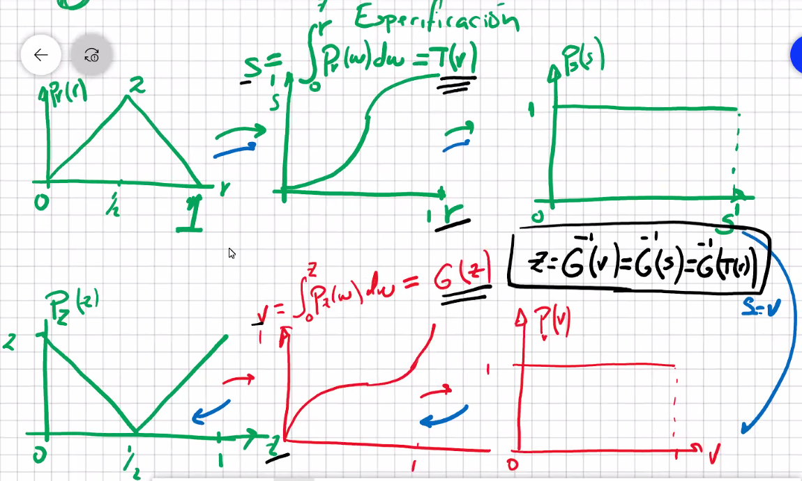
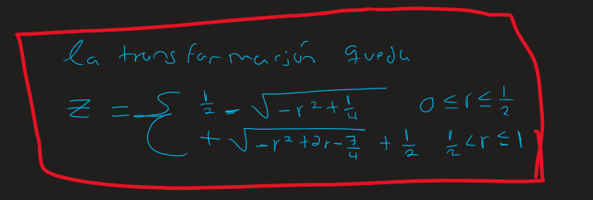
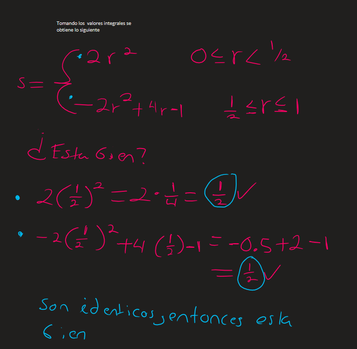
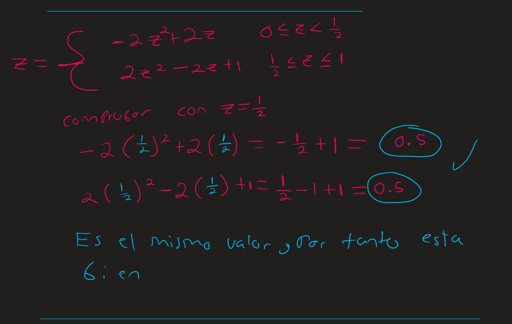
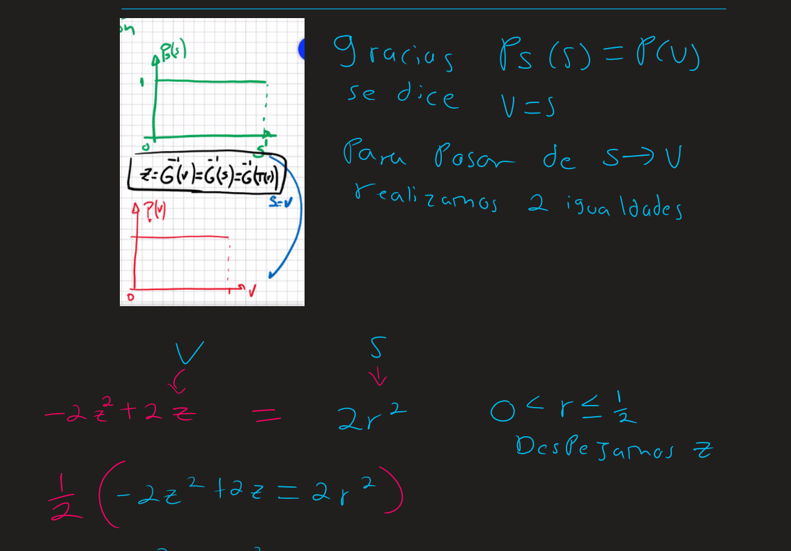
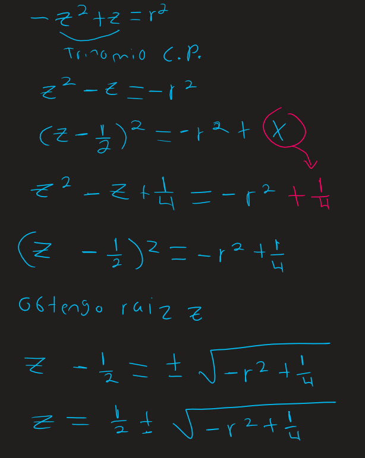
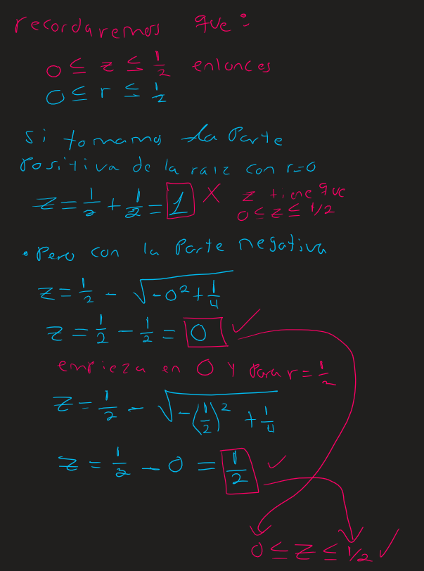
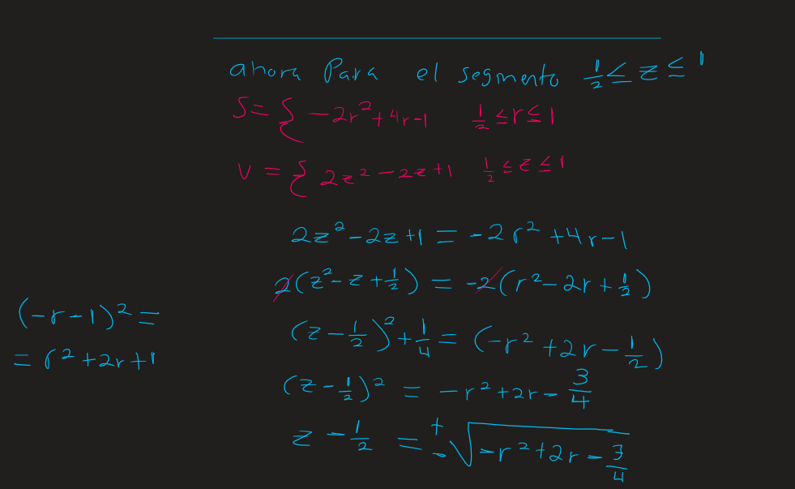
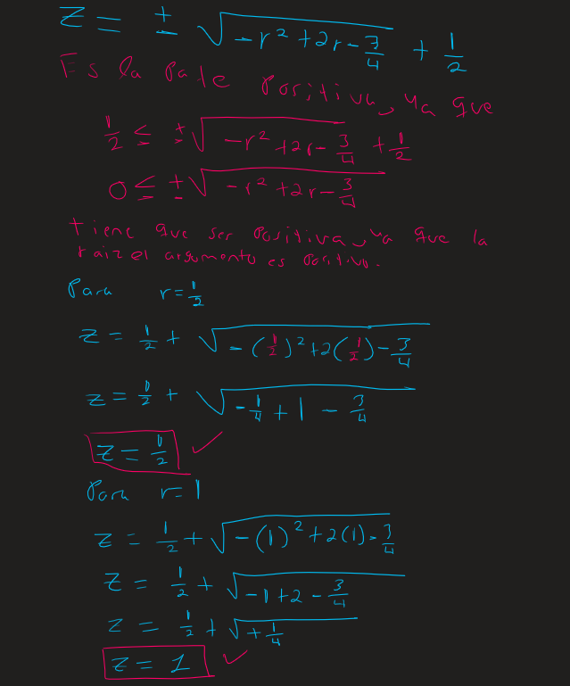

```
Tarea 5
Barrera Peña Víctor  Miguel
Clase (Procesamiento digital de imágenes)
Universidad Nacional Autónoma de México (UNAM),
Ciudad de México, México
tareas.victor.miguel.barrera.pena@gmail.com
Fecha entrega: 04/04/2024
```

# Actividad

Dado el diagrama, mas una ayuda que se da en el mismo.
Encontrar la función de transformación continua Z, que especifica el histograma P(r) a P(z).



# Resultado




# Procedimiento
















