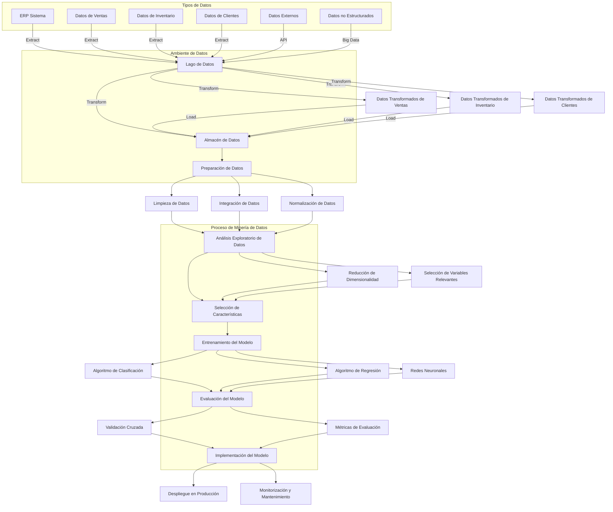

<style>
    h1 {
        background-color: #f0a500; /* Color de fondo amarillo anaranjado */
        color: white; /* Color del texto blanco */
        text-align: center; /* Texto centrado */
        line-height: 1.25; /* Espaciado entre líneas de 1.25 */
        padding: 10px; /* Espaciado interno */
        border-radius: 5px; /* Bordes redondeados */
    }h2 {
        background-color: #007acc; /* Color de fondo azul */
        color: white; /* Color del texto blanco */
        text-align: center; /* Texto centrado */
        line-height: 1.25; /* Espaciado entre líneas de 1.25 */
        padding: 8px; /* Espaciado interno */
        border-radius: 5px; /* Bordes redondeados */
    }h3 {
        background-color: #28a745; /* Color de fondo verde */
        color: white; /* Color del texto blanco */
        text-align: center; /* Texto centrado */
        line-height: 1.25; /* Espaciado entre líneas de 1.25 */
        padding: 6px; /* Espaciado interno */
        border-radius: 5px; /* Bordes redondeados */
    } p {
        line-height: 1.25; /* Espaciado entre líneas de 1.25 */
    }
</style>


```
UNAM Facultad de Ingeniería
Ingeniería en Computación
Asignatura: Minería de Datos
Examen 3 – Final Mayo 19, 2024
NOMBRE: Barrera Peña Victor Miguel
Nota importante: No realizar “copiar y pegar” un texto, se debe resumir lo que se entienda.
No compartir información con compañeros de clase y ser breves y concretos en sus
respuestas.
```

# Actividad

1. ¿Qué es Minería de Datos y que me puede aportar de valor a mi empresa?, Pregunta de un Cliente, que le responderías (Utilizar un lenguaje coloquial y comprensible para cualquier cliente)
2. En una organización, cuáles son los principales procesos de negocio donde la Minería de Datos se verían beneficiados (seleccione 3), ¿Y describa cómo sería?
3. ¿Cuáles son los desafíos que tiene que enfrentar el proceso de Minería de Datos? y que tipo de iniciativas ayudarían a minimizar el impacto? 
4. ¿Describir los componentes de un **plan de trabajo que se presentaría al cliente** para implementar Minería de Datos, que contemple todas actividades? Y determine que argumentos podemos darle al cliente para que tenga confianza en los resultados del proyecto.
5. ¿Cómo Ingeniero en Computación describa que participantes, metodología, herramientas y tecnología utilizarías en una propuesta con cliente? 
6. Si tuvieras una entrevista con en una compañía donde se solicita un experto de Minería de datos para que trabaje en el área de procesos de distribución de productos, si te piden comentar sobre tu experiencia en Minería de Datos que dirías. 
7. Crear una gráfica de la arquitectura del proceso de Minería de Datos señalando con detalle el ambiente de datos que considere los diferentes tipos de datos desde el ERP hasta Big Bata.
8. Ya se realizaron pruebas de los algoritmos de minería con datos históricos y se obtuvieron resultados interesantes para el cliente, **detalle las actividades** que se deberían de realizar para concluir un proyecto de Minería de Datos 
9. Se tiene una reunión con un cliente de Ventas y marketing de Farmacias del Ahorro interesado en el proceso de Minería de datos, a) indique que preguntas le realizarías para conocer su requerimiento, y b) que comentarios le darías para que tenga confianza en el proceso. 
10. Se tienen registro de 10,000 pacientes diagnosticados con algún tipo de diabetes, se desea conocer cuáles son las variables tienen mayor impacto para ayudar a prevenirlo, que algoritmos predictivos se propondrían para realizar el estudio, describir el proceso de minería de datos.

# Solución

## 1) ¿Qué es Minería de Datos y que me puede aportar de valor a mi empresa?, Pregunta de un Cliente, que le responderías (Utilizar un lenguaje coloquial y comprensible para cualquier cliente)

**¿Qué es la Minería de Datos?**

- Es como buscar oro, pero en lugar de buscar en la tierra, buscamos información valiosa en grandes cantidades de datos. Tenemos información bruto y el objetivo es descubrir nueva información que sea valiosa como lo es el oro obtenido de la tierra, esto quiere decir que el oro ya está ahí, lo que queda es encontrar el valor oculto entre la información.

**Beneficios para tu Empresa:**

Depende el rubro al que te dediques, porque los beneficios son de acuerdo al negocio, sin embargo puedo abstraer de manera más generalista:

- Obtener modelos de información que permitan obtener ventanas de oportunidad basado en análisis de datos.
- Control, gestión y optimización de los recursos que se  tienen medidos, no se pueden controlar sistemas si es que no están medidos.
- Predicción y monitorización en el tiempo de manera automatizada, los sistemas que gestionan la información pueden medir la información y tomar acciones en el instante en que se manifiesten anomalías.


## 2) En una organización, ¿cuáles son los principales procesos de negocio donde la Minería de Datos se verían beneficiados (seleccione 3), y cómo sería?

- **Ventas y Marketing:** Pueden obtener información sobre los productos para saber qué es lo que quieren o necesitan los clientes, cuáles son los problemas con sus productos y así mejorar su oferta.
- **Nuevos Insights:** A partir de los datos recolectados y almacenados, se pueden descubrir nuevos modelos de negocio o identificar oportunidades que permitan a la empresa crecer.
- **Segmentación de Clientes:** Se puede recopilar información sobre quiénes son los clientes y, con ello, enfocarse en vender a nuevos clientes con gustos y preferencias similares.

## 3) ¿Cuáles son los desafíos que tiene que enfrentar el proceso de Minería de Datos? y que tipo de iniciativas ayudarían a minimizar el impacto? 

| Desafíos                               | Problema                                                     | Iniciativas para minimizar el impacto                        |
| -------------------------------------- | ------------------------------------------------------------ | ------------------------------------------------------------ |
| **Calidad de los datos**               | Los datos pueden estar incompletos, duplicados o tener errores, afectando  el análisis. | Implementar procesos de limpieza y validación de datos para asegurar su calidad. |
| **Gran volumen de datos**              | Manejar grandes cantidades de datos puede ser complejo y costoso en términos de almacenamiento y procesamiento. | Utilizar tecnologías de Big data y almacenamiento en la nube para gestionar y procesar grandes volúmenes de datos de manera eficiente. |
| **Privacidad y  políticas de guridad** | Proteger la información sensible y cumplir con las regulaciones de privacidad es crucial. | Establecer políticas estrictas de seguridad de datos, utilizar técnicas de anonimización como puede ser: encriptación, distribución de datos, compresión de datos. |
| **Interpretación de resultados**       | Los resultados pueden ser difíciles de interpretar sin un conocimiento adecuado de los métodos y técnicas utilizados. | Capacitar a los empleados en análisis de datos y contratar especialistas en ciencia de datos, además de tener conexión con propietarios del negocio, ya que ellos conocen excelente el negocio para interpretar los resultados correctamente. |
| **Integración de datos**               | Los datos provienen de múltiples fuentes y formatos, lo que dificulta su integración y análisis. | Implementar sistemas de integración de datos y utilizar herramientas de ETL  para unificar datos de diferentes fuentes. |
| **Problemas de almacenaje**            | Los costos y la capacidad limitada de almacenamiento pueden ser un problema. | Adoptar soluciones de almacenamiento en la nube y tecnologías de compresión  y optimización de datos. |
| **Problemas físicos**                  | Los servidores y equipos físicos pueden sufrir fallos, causando pérdida de datos o interrupciones. | Implementar redundancias y copias de seguridad regulares, además de un plan de recuperación ante desastres para asegurar  la protección del negocio. |
| **Automatización de procesos**         | Utilizar herramientas de software que automaticen la limpieza, integración y análisis de datos, ya que de no hacerse, puede existir un excedente de costo. | Uso herramientas avanzadas de automatización para mejorar la eficiencia y precisión en el manejo de datos, de la mano hay autónoma |

## 4) ¿Describir los componentes de un plan de trabajo que se presentaría al cliente para implementar Minería de Datos, que contemple todas actividades? Y determine que argumentos podemos darle al cliente para que tenga confianza en los resultados del proyecto.

| Fase | Componentes                                      | Actividades                                       | ¿Por qué se lleva a cabo? (argumentos)                       |
| ---- | ------------------------------------------------ | ------------------------------------------------- | ------------------------------------------------------------ |
| 1    | definición del problema y objetivos del proyecto | definir el problema y establecer objetivos claros | para asegurar que todos en el proyecto entiendan el objetivo, por ejemplo, mejorar la retención de clientes. si no se lleva a cabo, el proyecto puede perder dirección y no resolver el problema real, causando desperdicio de recursos |
| 2    | recopilación y preparación de datos              | obtener y limpiar los datos necesarios            | para garantizar que los datos utilizados sean precisos y completos, por ejemplo, datos de ventas de los últimos cinco años. si no se realiza, pueden tomarse decisiones basadas en datos incorrectos o incompletos, lo que afectará negativamente los resultados del proyecto |
| 3    | análisis exploratorio de datos (EDA)             | explorar y visualizar los datos                   | para identificar patrones iniciales y relaciones en los datos, por ejemplo, encontrar picos de ventas en ciertos meses. si no se efectúa, se pueden pasar por alto tendencias importantes, afectando la calidad del análisis y las decisiones subsecuentes |
| 4    | selección de métodos y algoritmos                | elegir los modelos y técnicas adecuados           | para asegurar el uso de las técnicas más apropiadas, por ejemplo, elegir regresión para predecir ventas futuras. si no se lleva a cabo, se podrían utilizar métodos inadecuados que no proporcionen resultados precisos, reduciendo la efectividad del proyecto |
| 5    | desarrollo y entrenamiento de modelos            | construir y entrenar los modelos                  | para crear modelos precisos y eficientes, por ejemplo, entrenar un modelo de clasificación para segmentar clientes. si no se realiza, los modelos pueden no ser efectivos y dar predicciones incorrectas, afectando la toma de decisiones basada en ellos |
| 6    | validación y evaluación de modelos               | probar y ajustar los modelos                      | para asegurar la precisión y confiabilidad de los modelos, por ejemplo, validando el modelo con datos de prueba. si no se realiza, los modelos pueden no ser fiables y fallar en situaciones reales, afectando la confianza en los resultados del proyecto |
| 7    | implementación del modelo                        | integrar el modelo en el sistema operativo        | para aplicar el modelo en el negocio y obtener sus beneficios, por ejemplo, implementar el modelo en el sistema de CRM. si no se efectúa, el modelo no podrá ser utilizado y sus beneficios no se materializarán, dejando el proyecto incompleto |
| 8    | monitoreo y mantenimiento                        | monitorear y actualizar el modelo                 | para mantener la precisión y relevancia del modelo, por ejemplo, actualizándolo con datos mensuales nuevos. si no se realiza, el modelo puede volverse obsoleto y menos efectivo con el tiempo, reduciendo su utilidad para el negocio |
| 9    | documentación y reportes                         | documentar todo el proceso y los resultados       | para proporcionar transparencia y una referencia completa del proceso, por ejemplo, generando reportes detallados para los directivos. si no se lleva a cabo, puede haber falta de claridad y dificultades para replicar o revisar el proyecto en el futuro |

## 5) ¿Cómo Ingeniero en Computación describa que participantes, metodología, herramientas y tecnología utilizarías en una propuesta con cliente? 

Vendiéndome como perfil de Ingeniero en IA, sería la siguiente estructura:

### Participantes

| **Rol**                    | **Responsabilidades**                                        |
| -------------------------- | ------------------------------------------------------------ |
| **Gerente de Proyecto**    | Planificación, ejecución y cierre del proyecto. Asegurar que se cumplan los plazos y objetivos. |
| **Ingenieros de Software** | Implementación del código y desarrollo de la solución.       |
| **Científicos de Datos**   | Creación y validación de modelos predictivos.                |
| **Ingenieros de DevOps**   | Automatización, implementación y monitoreo de la infraestructura. |
| **Analistas de Negocios**  | Intermediarios entre el cliente y el equipo técnico. Traducción de requisitos del negocio en especificaciones técnicas. |
| **Diseñadores de UX/UI**   | Diseño de interfaces de usuario atractivas y fáciles de usar, que sea sobre todo atractivo a la vista. |

### Metodología  Ágil (Scrum)

| **Etapa**                                    | **Descripción**                                              |
| -------------------------------------------- | ------------------------------------------------------------ |
| **Reunión Inicial y Análisis de Requisitos** | Entrevistas y talleres con el cliente para entender sus necesidades y objetivos. |
| **Sprints**                                  | Ciclos de desarrollo cortos y enfocados, generalmente de 2-4 semanas. |
| **Daily Standups**                           | Reuniones diarias para sincronizar el progreso y resolver impedimentos. |
| **Revisión y Retrospectiva**                 | Evaluaciones al final de cada sprint para revisar el trabajo completado y mejorar procesos. |
| **Desarrollo Iterativo**                     | Desarrollo del proyecto en fases, permitiendo ajustes y mejoras continuas basadas en el feedback del cliente. |

### Herramientas

| **Categoría**                   | **Herramientas**                 | **Descripción**                                       |
| ------------------------------- | -------------------------------- | ----------------------------------------------------- |
| **Gestión de Proyectos**        | Jira, Trello, Asana              | Seguimiento de tareas y gestión del flujo de trabajo. |
| **Control de Versiones**        | Git, GitHub, GitLab              | Manejo colaborativo del código.                       |
| **Comunicación y Colaboración** | Slack, Microsoft Teams, Zoom     | Comunicación interna y con el cliente.                |
| **CI/CD**                       | Jenkins, GitLab CI/CD, Travis CI | Automatización de pruebas y despliegues.              |
| **Monitoreo y Logging**         | Prometheus, Grafana, ELK Stack   | Supervisión de la infraestructura y análisis de logs. |

### Tecnología

| **Categoría**                 | **Tecnología**                                | **Descripción**                                          |
| ----------------------------- | --------------------------------------------- | -------------------------------------------------------- |
| **Lenguajes de Programación** | Python, JavaScript, Java,Go.                  | Dependiendo de los requisitos del proyecto.              |
| **Frameworks de Desarrollo**  | Django, Flask, Spring Boot, Node.js (Backend) | React, Angular, Vue.js (Frontend)                        |
| **Bases de Datos**            | PostgreSQL, MySQL (Relacionales)              | MongoDB, Cassandra (NoSQL)                               |
| **Plataformas en la Nube**    | AWS, Google Cloud Platform, Azure             | Infraestructura escalable y servicios gestionados.       |
| **Herramientas de IA y ML**   | TensorFlow, PyTorch, Scikit-learn             | Desarrollo de modelos predictivos.                       |
| **Procesamiento de Datos**    | Apache Spark, tecnologías de NVIDIA, tensorRT | Procesamiento de grandes volúmenes de datos en paralelo. |

Creación del documento 

- Uso de inteligencia artificial para que sea conciso, elegante y rápida creación (en ello soy usuario recurrente).
- Implementación gráficos mediante el uso de IA.
- Una metodología que esta en desarrollo, pero básicamente es la creación de propuesta en tiempo real usando IA y entrenamiento RAG LLM en servidores para que la nueva propuesta de proyecto se base con respecto a proyectos que ya se han tenido por el mismo equipo.


## 6) Si tuvieras una entrevista con en una compañía donde se solicita un experto de Minería de datos para que trabaje en el área de procesos de distribución de productos, si te piden comentar sobre tu experiencia en Minería de Datos que dirías. 

Si revisa mi perfil de GitHub, podrá ver que tengo numerosos proyectos relacionados con el tratamiento de datos, especialmente en el entrenamiento de inteligencia artificial y mi incursión en el deep learning. También he trabajado con procesamiento de datos en paralelo utilizando NVIDIA. Estoy bastante seguro de que cualquier proceso que requiera análisis de datos e implementación de modelos puede llevarse a cabo con éxito. Solo necesitamos sentarnos a discutir los datos y comprender el propósito para delinear un plan de trabajo adecuado.

En cuanto a implementaciones, tengo experiencia considerable, y por la parte matemática, no hay problema, ya que mi segunda carrera es en matemáticas. La única posible limitación podría ser el recurso y el tiempo, pero esas limitaciones no dependen de mí.

## 7) Crear una gráfica de la arquitectura del proceso de Minería de Datos señalando con detalle el ambiente de datos que considere los diferentes tipos de datos desde el ERP hasta Big Bata.




## 8) Ya se realizaron pruebas de los algoritmos de minería con datos históricos y se obtuvieron resultados interesantes para el cliente, detalle las actividades que se deberían de realizar para concluir un proyecto de Minería de Datos 

Ya se había explicado en anterior pregunta, sin embargo , este ciclo siguiente queda a verificación del proyecto, ya que puede que la empresa contrate para que el sistema tenga mejora continua y siempre empezara el bucle en validación hasta monitoreo y  mantenimiento y las ultimas dos fases no se llevarán a acabo  simplemente el modelo se estará mejorando de aquí al infiinito.

| **Actividad**                   | **Descripción**                                              |
| ------------------------------- | ------------------------------------------------------------ |
| **Validación de resultados**    | Revisar y confirmar con el cliente que los resultados obtenidos cumplen con sus expectativas. |
| **Ajustes y optimización**      | Ajustar y optimizar los modelos para mejorar su precisión y rendimiento. |
| **Implementación y despliegue** | Desplegar los modelos en el entorno de producción y automatizar el procesamiento de nuevos datos. |
| **Monitoreo y mantenimiento**   | Supervisar continuamente los modelos y realizar actualizaciones y mantenimiento periódico. |
| **Formación y transferencia**   | Capacitar al personal del cliente en el uso de los modelos y herramientas, y documentar el proyecto. |
| **Cierre del proyecto**         | Revisar y obtener feedback final del cliente, entregar documentación completa, y oficializar el cierre. |


## 9) Se tiene una reunión con un cliente de Ventas y marketing de Farmacias del Ahorro interesado en el proceso de Minería de datos, a) indique que preguntas le realizarías para conocer su requerimiento, y b) que comentarios le darías para que tenga confianza en el proceso. 

### a) Preguntas para conocer el requerimiento del cliente

1. ¿Cuáles son los principales objetivos que desea alcanzar con el proceso de minería de datos?
2. ¿qué tipo de datos tiene disponible actualmente (ventas, inventarios, datos de clientes, etc.)?
3. ¿con qué frecuencia se generan y actualizan estos datos?
4. ¿existen problemas específicos o áreas de interés que le gustaría abordar (por ejemplo, optimización de inventario, segmentación de clientes, campañas de marketing)?
5. ¿qué resultados espera obtener del análisis de estos datos?
6. ¿tiene alguna preferencia o restricción en cuanto a las herramientas y tecnologías a utilizar?
7. ¿cómo se integra actualmente la información de ventas y marketing en sus sistemas?
8. ¿qué recursos (humanos, tecnológicos, financieros) están disponibles para este proyecto?
9. ¿existen otros proyectos en curso que puedan afectar o beneficiarse de esta iniciativa?
10. ¿cuáles son los plazos esperados para ver resultados significativos del proyecto?
11. ¿cómo se medirá el éxito del proyecto de minería de datos?
12. ¿hay alguna política de privacidad o normativa específica que debamos considerar en el manejo de los datos?
13. ¿qué tecnologías y plataformas utiliza actualmente en su infraestructura de TI?
14. ¿tiene experiencia previa con proyectos de análisis de datos o minería de datos?
15. ¿qué nivel de involucramiento técnico espera de su equipo durante el proyecto?
16. ¿de dónde surgió la idea para implementar un sistema de minería de datos?
17. ¿tiene alguna otra idea o expectativa específica sobre cómo este sistema podría beneficiar a su empresa?
18. ¿cómo espera que se integre el nuevo sistema con las operaciones diarias de su equipo de ventas y marketing?
19. ¿el sistema tiene alguna restricción de tecnología?
20. ¿Qué tan propenso puede estar a fallar el sistema?
21. ¿es urgente?
22. ¿Qué tanta disponibilidad necesita ?

### b) Comentarios para generar confianza en el proceso (suponiendo que es una empresa con cierto renombre, en este caso es inventada)

1. Nuestra experiencia en proyectos similares ha mostrado resultados significativos en la optimización de ventas y campañas de marketing, y tratamiento con inteligencia artificial.
2. utilizamos metodologías probadas y herramientas avanzadas que garantizan la precisión y utilidad de los resultados.
3. estamos comprometidos con la privacidad y seguridad de los datos, cumpliendo con todas las normativas y políticas de protección de datos.
4. ofrecemos un enfoque colaborativo, asegurándonos de entender y alinearnos con sus objetivos comerciales.
5. proporcionamos informes y visualizaciones claras para que pueda interpretar fácilmente los resultados y tomar decisiones informadas.
6. contamos con un equipo de expertos en análisis de datos, inteligencia artificial y tecnología, preparados para abordar cualquier desafío.
7. nuestro proceso incluye una fase de validación para asegurarnos de que los resultados sean precisos y relevantes para sus necesidades.
8. hemos implementado proyectos exitosos en la industria farmacéutica y minorista, lo que nos da una ventaja en entender sus desafíos específicos.
9. mantenemos una comunicación constante y transparente durante todo el proyecto, asegurándonos de que esté informado en cada etapa.
10. nuestros servicios incluyen soporte post-implementación para asegurar que los modelos sigan funcionando de manera óptima y se ajusten a nuevas necesidades.
11. adaptamos nuestras soluciones a las tecnologías y sistemas que ya utilizan, asegurando una integración sin problemas.
12. estamos aquí para ayudar a su equipo a entender y utilizar los resultados, proporcionando formación y documentación completa.

Obviamente no se puede mentir, estoy haciendo una suposición.

## 10) Se tienen registro de 10,000 pacientes diagnosticados con algún tipo de diabetes, se desea conocer cuáles son las variables tienen mayor impacto para ayudar a prevenirlo, que algoritmos predictivos se propondrían para realizar el estudio, describir el proceso de minería de datos.

Para este punto quiero ser muy simple en mi explicación porque es una implementación muy compleja.

Para este algoritmo únicamente quiero DNN, porque es la tecnología que ha mostrado superioridad en precisión sobre las demás, 10,000 es muy poco para entrenamiento si no hay suficientes variables, sin embargo servirá como punto de inicio.

No importa el tiempo, es cuestión salud  por ello lo que importa es precisión  y confiabilidad, si los costos lo permiten ese es el enfoque.

Lo primero es determinar las variables conocidas y aquellas que ya se han estudiado por profesionales de la salud es decir

**Variables conocidas:**

| Variable                       | Explicación                                                  |
| ------------------------------ | ------------------------------------------------------------ |
| Índice de Masa Corporal (IMC)  | Medida de la grasa corporal basada en peso y altura. Un IMC alto indica obesidad. |
| Hábitos alimenticios           | Patrones de consumo de alimentos, especialmente el consumo de comidas rápidas y azucaradas. |
| Nivel de actividad física      | Cantidad de ejercicio realizado. Menos ejercicio lleva al aumento de peso. |
| Genética                       | Predisposición hereditaria a la obesidad. Los genes afectan el metabolismo y el almacenamiento de grasa. |
| Metabolismo basal              | Tasa a la cual el cuerpo quema calorías en reposo. Un metabolismo lento puede resultar en la acumulación de grasa. |
| Factores socioeconómicos       | Nivel de ingresos y educación. Menos recursos pueden limitar el acceso a alimentos saludables y oportunidades para hacer ejercicio. |
| Condiciones médicas            | Enfermedades como hipotiroidismo que pueden dificultar la pérdida de peso. |
| Consumo de medicamentos        | Algunos medicamentos pueden causar aumento de peso como efecto secundario. |
| Patrones de sueño              | La falta de sueño puede aumentar el apetito y la preferencia por alimentos poco saludables. |
| Estrés y factores psicológicos | El estrés puede llevar a comer en exceso y elegir alimentos poco saludables. |


Con la red determinar la estructura de la red empezar a entrenar, a la vez que tener un banco de datos para guardar los avances y de ser posible crear una red neuronal mucho más grande pero con menor peso BitNet b1.58 pero ahora al campo de tratamiento con datos, nos permitiría una red neuronal más grande pero computacionalmente más eficiente.

El demás proceso solo es validación y optimización del modelo con ayuda de los médicos y especializastas para corroborar la validez del modelo, para este caso me gustaria un 70% y 30%, pero tambien un zero shot con un nuevo caso que no este en los datos de entrenamiento a partir de entrenar a la red neuronal por batch size.
