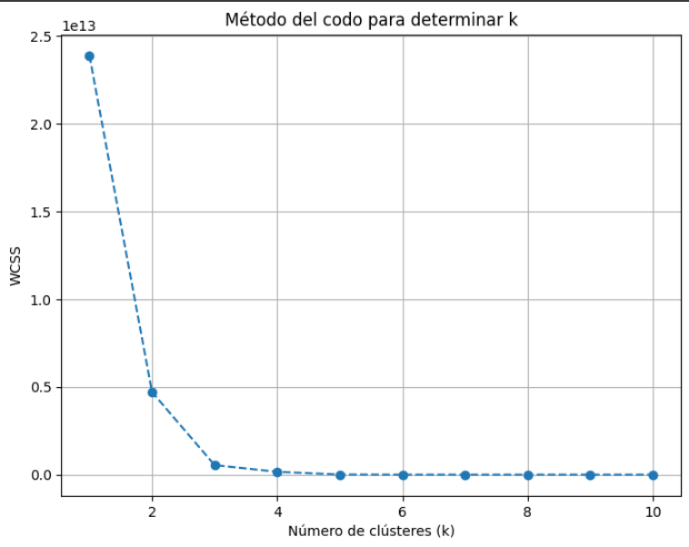
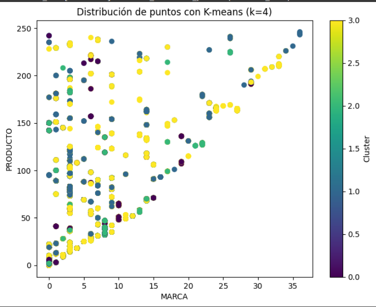
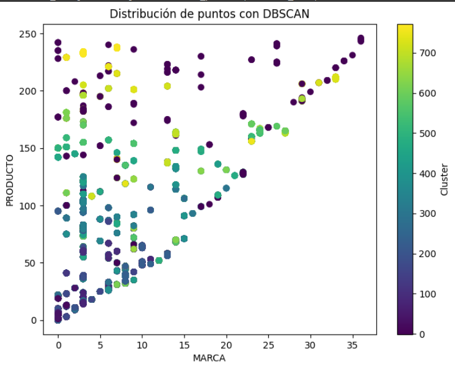
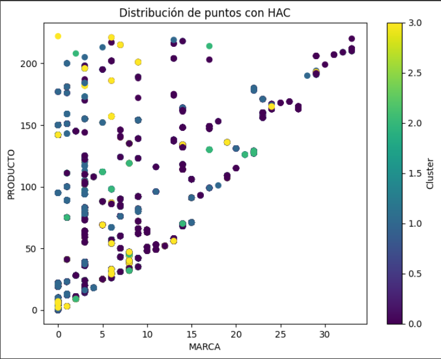

# Proyecto 3.1 Cluster

Una empresa de distribución de bebidas de diferentes marcas realiza la distribución y venta a tiendas pequeñas con diferentes surtidos de acuerdo solicitud del dueño del negocio. El propósito que se requiere es sugerir algunas bebidas que no le solicita para conocer su comportamiento de venta, para ello se deben seleccionar marcas que sea más adecuadas al lugar y tamaño de la Tienda.

Como primera etapa se debe realizar una segmentación de tiendas en base a la Marca de bebidas vendidas.

# 1) Realizar los siguientes ejercicios utilizando:

1. Con RapidMiner utilizar los algoritmos de K-means y DBScan
2. Con Python incluir el método de Elbows para determinar el número de clusters y el algoritmo de K-means
3. Con Python realizar la segmentación con DBScan
4. Se puede incluir algun algoritmo adicional que permita ver el comportamiento de los datos
5. Realizar la limpieza y Transformación que sea requerida de los datos enviados

# 2) Identificar el comportamiento de cada segmento y dar una explicación

Nota: Utilizar el set de datos Venta_bebidas_Demo, se recomienda primero elegir una muestra para validar los algoritmos.


# Solución

## 2) Con Python incluir el método de Elbows para determinar el número de clusters y el algoritmo de K-means

**Elbows:**

```python
import pandas as pd
import numpy as np
import matplotlib.pyplot as plt
from sklearn.cluster import KMeans

# Cargar los datos desde el archivo CSV (ajusta el nombre del archivo según tu caso)
data = pd.read_csv("Ventas_Bebidas_Demo.csv")

# Crear un diccionario para mapear MARCA y PRODUCTO a valores numéricos
marca_mapping = {marca: i for i, marca in enumerate(data["MARCA"].unique())}
producto_mapping = {producto: i for i, producto in enumerate(data["PRODUCTO"].unique())}

# Reemplazar los valores categóricos con los valores numéricos
data["MARCA"] = data["MARCA"].map(marca_mapping)
data["PRODUCTO"] = data["PRODUCTO"].map(producto_mapping)

# Seleccionar las variables relevantes (MARCA, PRODUCTO, TIENDA)
selected_data = data[["MARCA", "PRODUCTO", "TIENDA"]]

# Determinar el número óptimo de clústeres utilizando la regla del codo
wcss = []
for k in range(1, 11):
    kmeans = KMeans(n_clusters=k, init='k-means++', random_state=42)
    kmeans.fit(selected_data)
    wcss.append(kmeans.inertia_)

# Graficar la curva del codo
plt.figure(figsize=(8, 6))
plt.plot(range(1, 11), wcss, marker='o', linestyle='--')
plt.xlabel('Número de clústeres (k)')
plt.ylabel('WCSS')
plt.title('Método del codo para determinar k')
plt.grid()
plt.show()

# Seleccionar el valor óptimo de k basado en la gráfica
optimal_k = 3  # Supongamos que el codo está en k=3
kmeans_final = KMeans(n_clusters=optimal_k, init='k-means++', random_state=42)
selected_data['cluster'] = kmeans_final.fit_predict(selected_data)
```



El optimo podría ser 3 ó 4, ya que es donde se observa el codo.



**Dbscan:**

```python
import pandas as pd
import numpy as np
import matplotlib.pyplot as plt
from sklearn.cluster import DBSCAN

# Cargar los datos desde el archivo CSV (ajusta el nombre del archivo según tu caso)
data = pd.read_csv("Ventas_Bebidas_Demo.csv")

# Crear un diccionario para mapear MARCA y PRODUCTO a valores numéricos
marca_mapping = {marca: i for i, marca in enumerate(data["MARCA"].unique())}
producto_mapping = {producto: i for i, producto in enumerate(data["PRODUCTO"].unique())}

# Reemplazar los valores categóricos con los valores numéricos
data["MARCA"] = data["MARCA"].map(marca_mapping)
data["PRODUCTO"] = data["PRODUCTO"].map(producto_mapping)

# Seleccionar las variables relevantes (MARCA, PRODUCTO, TIENDA)
selected_data = data[["MARCA", "PRODUCTO", "TIENDA"]]

# Aplicar DBSCAN con parámetros eps=0.5 y min_samples=5
dbscan = DBSCAN(eps=0.5, min_samples=5)
selected_data['cluster'] = dbscan.fit_predict(selected_data)

# Visualizar la distribución de puntos
plt.figure(figsize=(8, 6))
plt.scatter(selected_data["MARCA"], selected_data["PRODUCTO"], c=selected_data["cluster"], cmap='viridis')
plt.xlabel('MARCA')
plt.ylabel('PRODUCTO')
plt.title('Distribución de puntos con DBSCAN')
plt.colorbar(label='Cluster')
plt.show()

```




**Algoritmo de Agrupamiento Jerárquico (Hierarchical Agglomerative Clustering - HAC)**

```python
import pandas as pd
import numpy as np
import matplotlib.pyplot as plt
from sklearn.cluster import AgglomerativeClustering

# Cargar los datos desde el archivo CSV (ajusta el nombre del archivo según tu caso)
data = pd.read_csv("Ventas_Bebidas_Demo.csv")

# Crear un diccionario para mapear MARCA y PRODUCTO a valores numéricos
marca_mapping = {marca: i for i, marca in enumerate(data["MARCA"].unique())}
producto_mapping = {producto: i for i, producto in enumerate(data["PRODUCTO"].unique())}

# Reemplazar los valores categóricos con los valores numéricos
data["MARCA"] = data["MARCA"].map(marca_mapping)
data["PRODUCTO"] = data["PRODUCTO"].map(producto_mapping)

# Seleccionar las variables relevantes (MARCA, PRODUCTO, TIENDA)
selected_data = data[["MARCA", "PRODUCTO", "TIENDA"]]

# Aplicar HAC con parámetros n_clusters=4 y linkage='ward'
hac = AgglomerativeClustering(n_clusters=4, linkage='ward')
selected_data['cluster'] = hac.fit_predict(selected_data)

# Visualizar la distribución de puntos
plt.figure(figsize=(8, 6))
plt.scatter(selected_data["MARCA"], selected_data["PRODUCTO"], c=selected_data["cluster"], cmap='viridis')
plt.xlabel('MARCA')
plt.ylabel('PRODUCTO')
plt.title('Distribución de puntos con HAC')
plt.colorbar(label='Cluster')
plt.show()

```

