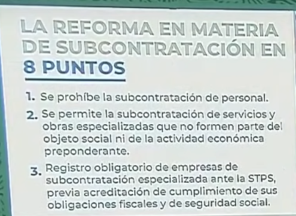
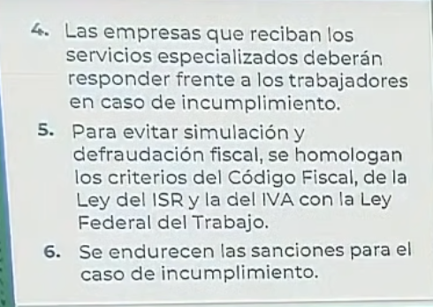
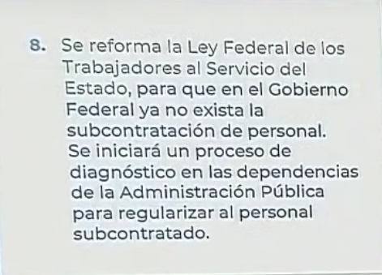
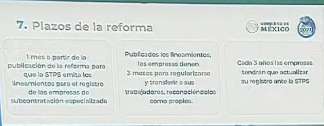

<style>
    h1 {
        background-color: #f0a500; /* Color de fondo amarillo anaranjado */
        color: white; /* Color del texto blanco */
        text-align: center; /* Texto centrado */
        line-height: 1.25; /* Espaciado entre líneas de 1.25 */
        padding: 10px; /* Espaciado interno */
        border-radius: 5px; /* Bordes redondeados */
    }h2 {
        background-color: #007acc; /* Color de fondo azul */
        color: white; /* Color del texto blanco */
        text-align: center; /* Texto centrado */
        line-height: 1.25; /* Espaciado entre líneas de 1.25 */
        padding: 8px; /* Espaciado interno */
        border-radius: 5px; /* Bordes redondeados */
    }h3 {
        background-color: #28a745; /* Color de fondo verde */
        color: white; /* Color del texto blanco */
        text-align: center; /* Texto centrado */
        line-height: 1.25; /* Espaciado entre líneas de 1.25 */
        padding: 6px; /* Espaciado interno */
        border-radius: 5px; /* Bordes redondeados */
    } p {
		line-height: 1.25; /* Espaciado entre líneas de 1.25 */
    }
</style>

```yaml
Universidad: UNAM,CU
Facultad: Ingeniería
Nombre: Víctor Miguel Barrera Peña
Fecha: 22/05/2024
Título: Realice una compilacion acerca de las leyes de outsourcing, para posteriormente un contrato bajo un escenario de Outsourcing (NUEVO)
Materia: Administración de Centros de TI
```

# Actividad

Realice una compilación acerca de las leyes de outsourcing, para posteriormente un contrato bajo un  escenario de Outsourcing (NUEVO)

# Estado del outsorcing

El outsourcing, también conocido como subcontratación o tercerización, es una práctica en la que una empresa contrata a otra para que proporcione personal que realice actividades especializadas. Estas actividades pueden incluir tecnología, limpieza, seguridad, atención al cliente, recursos humanos, contratación, contabilidad, asesoría jurídica, mantenimiento, entre otros servicios.

La subcontratación está regulada por la Ley Federal del Trabajo en México, que establece que todos los empleados tercerizados deben gozar de los mismos derechos laborales que los empleados directos. La empresa subcontratada es responsable de garantizar estos derechos. Sin embargo, muchas empresas de outsourcing operan de manera ilegal o no cumplen con los requisitos legales, lo que perjudica directamente a los trabajadores.

Entre las ventajas del outsourcing se encuentran:
- Reducción de costos en ciertas áreas.
- Permite a la empresa enfocarse en su actividad principal.
- Favorece el crecimiento de la empresa.
- Delegación de procesos.
- Integración de personal especializado o extranjero.

Por otro lado, las desventajas incluyen:
- El trabajador no pertenece directamente a la empresa, lo que puede causar alta rotación.
- Limitación de oportunidades de crecimiento y promoción.
- Falta de mayores prestaciones laborales.
- Riesgo de caer con una empresa de outsourcing que no esté legalmente registrada.
- Si la subcontratación no es formal, los empleados podrían no disfrutar de sus derechos laborales.

El presidente Andrés Manuel López Obrador ha buscado regular el outsourcing debido a su uso para fraudes fiscales, evasión de impuestos y limitación de los derechos de los trabajadores. La iniciativa de ley presentada por el gobierno busca:
- Regular la subcontratación.
- Asegurar que las empresas cumplan con sus obligaciones laborales.
- Requerir la autorización de la Secretaría del Trabajo y Previsión Social.
- Inscribir a las empresas de outsourcing en un padrón público.

Estas medidas pretenden poner orden en el ámbito de la subcontratación y proteger los derechos de los trabajadores.

# 8 Puntos de la reforma outsorcing presentado en la mañanera (23/abril/2021)








Viendo la mañanera veo que el punto 7 se lo saltaron, pero solo fue la edición de milenio mal realizada, ya obteniendo el material original , el punto 7 habla de los plazos de regularización



# A partir del decreto presidencial  Diario oficial de la federación  23/04/2021 se obtiene lo siguiente:

#### Ley Federal del Trabajo

1. **Prohibición de la subcontratación de personal (Artículo 12)**
   - Se prohíbe la subcontratación de personal cuando una persona física o moral pone a disposición trabajadores propios en beneficio de otra.
   - Las agencias de empleo pueden participar en el reclutamiento, selección, entrenamiento y capacitación, pero no se considerarán patrones.

2. **Subcontratación de servicios especializados (Artículo 13)**
   - Permitida para servicios o ejecución de obras que no formen parte del objeto social ni de la actividad económica preponderante del beneficiario.
   - El contratista debe estar registrado en el padrón público.

3. **Formalización de contratos (Artículo 14)**
   - Debe existir un contrato por escrito especificando el objeto de los servicios y el número aproximado de trabajadores.
   - Responsabilidad solidaria si el contratista incumple con sus obligaciones.

4. **Registro obligatorio (Artículo 15)**
   - Los proveedores de servicios de subcontratación deben registrarse ante la Secretaría del Trabajo y Previsión Social.
   - Renovación del registro cada tres años.
   - Registro público disponible en un portal de Internet.

#### Ley del Seguro Social

1. **Condiciones y requisitos (Artículo 15 A)**
   - Los servicios especializados deben cumplir con las condiciones establecidas en la Ley Federal del Trabajo.
   - Responsabilidad solidaria si el contratista incumple obligaciones de seguridad social.
   - Información cuatrimestral sobre contratos celebrados.

#### Ley del Instituto del Fondo Nacional de la Vivienda para los Trabajadores

1. **Información cuatrimestral (Artículo 29 Bis)**
   - Los contratistas deben proporcionar información cuatrimestral sobre los contratos celebrados.
   - Incluye datos generales, contratos de servicio, montos de aportaciones y amortizaciones, información de los trabajadores y determinación del salario base de aportación.

#### Código Fiscal de la Federación

1. **No deducibilidad de pagos (Artículo 15-D)**
   - Pagos por subcontratación de personal no serán deducibles ni acreditables si están relacionados con el objeto social o la actividad económica preponderante del contratante.
   - Servicios especializados pueden ser deducibles si el contratista está registrado y cumple con los requisitos.

2. **Responsabilidad solidaria (Artículo 26, fracción XVI)**
   - Las personas que contraten servicios u obras especializadas serán responsables solidarios por las contribuciones causadas a cargo de los trabajadores.

### Contrato de Outsourcing bajo el nuevo marco legal

**Contrato de Servicios Especializados**

**Entre:**

- **Contratante:** [Nombre de la empresa beneficiaria]
- **Contratista:** [Nombre de la empresa prestadora de servicios]

**Cláusulas:**

1. **Objeto del contrato**
   - El contratista se obliga a prestar los servicios de [Descripción detallada de los servicios especializados u obras especializadas] a favor del contratante.

2. **Duración del contrato**
   - El presente contrato tendrá una vigencia de [Duración del contrato], iniciando el [Fecha de inicio] y terminando el [Fecha de finalización].

3. **Número de trabajadores**
   - El contratista empleará aproximadamente [Número aproximado de trabajadores] para la prestación de los servicios.

4. **Responsabilidad solidaria**
   - El contratante será responsable solidario en relación con los trabajadores utilizados para estas contrataciones, en caso de que el contratista incumpla con sus obligaciones laborales y de seguridad social.

5. **Obligaciones del contratista**
   - Registrar su actividad ante la Secretaría del Trabajo y Previsión Social.
   - Proporcionar cuatrimestralmente información sobre los contratos celebrados.
   - Cumplir con todas las obligaciones fiscales y de seguridad social.

6. **Obligaciones del contratante**
   - Verificar que el contratista cuente con el registro ante la Secretaría del Trabajo y Previsión Social.
   - Obtener copia de los comprobantes fiscales y de pago de las obligaciones de seguridad social y laborales del contratista.

7. **Incumplimiento**
   - En caso de incumplimiento por parte del contratista de las obligaciones derivadas de este contrato, el contratante podrá rescindir el contrato sin responsabilidad alguna, reservándose el derecho de exigir el cumplimiento de las obligaciones pendientes.

Este es un ejemplo básico de un contrato de outsourcing adaptado a las nuevas disposiciones legales sobre subcontratación laboral en México. Es recomendable que un abogado especializado revise y ajuste el contrato a las necesidades específicas de las partes involucradas.

[DOF - Diario Oficial de la Federación](https://www.dof.gob.mx/nota_detalle.php?codigo=5616745&fecha=23/04/2021#gsc.tab=0)


# Camara de diputados [SUBCONTRATACIÓN LABORAL (OUTSOURCING) Análisis de la Iniciativa que propone reformar diversas  Leyes en la materia, presentada por el Ejecutivo Federal]

### Compilación de Leyes sobre Outsourcing para Escenario de Contrato

**1. Ley Federal del Trabajo (LFT)**

**Artículos Clave:**
- **Artículo 12:** Define al intermediario como la persona que interviene en la contratación de personal para que preste servicios a un patrón. El intermediario no es considerado patrón.
- **Artículo 13:** Prohíbe la subcontratación de personal, es decir, cuando una persona física o moral proporciona trabajadores propios en beneficio de otra.
- **Artículo 14:** Establece que no se considerará subcontratación de personal la prestación de servicios especializados o la ejecución de obras especializadas que no formen parte del objeto social ni de la actividad económica de la beneficiaria.
- **Artículo 15:** Las personas físicas o morales que proporcionen servicios especializados deben contar con autorización de la Secretaría del Trabajo y Previsión Social.

**Sanciones:**
- **Artículo 1004-C:** Sanciones para quienes realicen subcontratación de personal de manera no permitida, con multas de 2,000 a 50,000 veces la Unidad de Medida y Actualización (UMA).

**2. Ley del Seguro Social (LSS)**

**Artículos Clave:**
- **Artículo 15-A:** La persona física o moral que contrate servicios especializados será responsable solidaria en relación con los trabajadores utilizados.
- **Artículo 75:** Clasificación de los patrones y obligaciones en materia de riesgos de trabajo.
- **Artículo 304-A:** Obligaciones de los patrones de presentar información al IMSS sobre la contratación de servicios especializados.
- **Artículo 304-B:** Multas por no presentar o presentar fuera del plazo la información requerida.

**3. Ley del Instituto del Fondo Nacional de la Vivienda para los Trabajadores (INFONAVIT)**

**Artículos Clave:**
- **Artículo 29 Bis:** Obligaciones de las personas físicas o morales que presten servicios especializados de proporcionar información trimestral al INFONAVIT sobre los contratos celebrados y los trabajadores involucrados.

### Contrato para Escenario de Outsourcing

**1. Datos de las Partes:**
- Nombre, denominación o razón social de las partes.
- Clase de persona moral.
- Objeto social.
- Domicilio social, fiscal y convencional.
- Número del Registro Federal de Contribuyentes (RFC) y del Registro Patronal ante el IMSS e INFONAVIT.
- Datos de la escritura pública y acta constitutiva.
- Nombre de los representantes legales.

**2. Objeto del Contrato:**
- Descripción detallada de los servicios especializados o de la obra especializada a realizar.
- Justificación del carácter especializado del trabajo.

**3. Duración:**
- Periodo de vigencia del contrato.

**4. Personal Involucrado:**
- Número estimado mensual de trabajadores.
- Perfiles, puestos o categorías de los trabajadores.
- Nombre, CURP, número de seguridad social y salario base de cotización de los trabajadores.

**5. Obligaciones del Contratista:**
- Cumplir con todas las obligaciones laborales, fiscales y de seguridad social.
- Mantener la autorización vigente de la Secretaría del Trabajo y Previsión Social.
- Proporcionar la información trimestral requerida al IMSS e INFONAVIT.

**6. Obligaciones del Contratante:**
- Verificar que el contratista cumpla con todas las obligaciones.
- Ser responsable solidario en caso de incumplimiento por parte del contratista.

**7. Sanciones:**
- Detallar las multas y sanciones aplicables en caso de incumplimiento, basándose en lo dispuesto en la LFT, LSS e INFONAVIT.

**8. Firma y Legalización:**
- Firmas de los representantes legales de ambas partes.
- Protocolización del contrato ante notario público si así se requiere.

Esta compilación y el esquema de contrato proporcionan un marco legal y operativo para formalizar una relación de outsourcing bajo las nuevas disposiciones legales en México, asegurando el cumplimiento de las obligaciones laborales y fiscales.

# Estructura del contrato

### Contrato de Prestación de Servicios Especializados (Outsourcing)

**1. Datos de las Partes:**

**Contratante:**
- Nombre: [Nombre de la empresa contratante]
- Denominación o razón social: [Razón social de la empresa]
- Clase de persona moral: [Tipo de empresa]
- Objeto social: [Objeto social de la empresa]
- Domicilio social: [Dirección de la empresa]
- RFC: [Registro Federal de Contribuyentes]
- Registro Patronal ante el IMSS: [Número de registro patronal]
- Datos de la escritura pública: [Número de escritura, fecha, nombre del notario, etc.]
- Representante legal: [Nombre del representante legal]

**Contratista:**
- Nombre: [Nombre de la empresa contratista]
- Denominación o razón social: [Razón social de la empresa]
- Clase de persona moral: [Tipo de empresa]
- Objeto social: [Objeto social de la empresa]
- Domicilio social: [Dirección de la empresa]
- RFC: [Registro Federal de Contribuyentes]
- Registro Patronal ante el IMSS: [Número de registro patronal]
- Datos de la escritura pública: [Número de escritura, fecha, nombre del notario, etc.]
- Representante legal: [Nombre del representante legal]

**2. Objeto del Contrato:**
El contratista se compromete a prestar los siguientes servicios especializados o a ejecutar las siguientes obras especializadas: [Descripción detallada de los servicios u obras]

**3. Duración del Contrato:**
Este contrato tendrá una duración de [período de tiempo], iniciando el [fecha de inicio] y finalizando el [fecha de terminación].

**4. Obligaciones del Contratista:**
- Contar con la autorización de la Secretaría del Trabajo y Previsión Social para prestar servicios especializados.
- Cumplir con todas las disposiciones aplicables en materia de seguridad, salud y medio ambiente en el trabajo.
- Informar trimestralmente al IMSS y al Infonavit sobre los contratos celebrados y el número de trabajadores involucrados.
- Proveer al contratante la documentación necesaria que acredite el cumplimiento de sus obligaciones laborales y fiscales.

**5. Obligaciones del Contratante:**
- Verificar que el contratista cumpla con todas las obligaciones en materia de seguridad social y laboral.
- Informar trimestralmente sobre los contratos de prestación de servicios y el número de trabajadores involucrados.

**6. Responsabilidad Solidaria:**
El contratante será responsable solidariamente con el contratista en caso de incumplimiento de las obligaciones laborales y de seguridad social por parte del contratista   .

**7. Confidencialidad:**
Ambas partes se comprometen a mantener la confidencialidad de toda la información y documentación a la que tengan acceso con motivo de la ejecución del presente contrato.

**8. Terminación del Contrato:**
El contrato podrá darse por terminado antes del vencimiento del plazo pactado por mutuo acuerdo entre las partes o por incumplimiento de alguna de las obligaciones aquí establecidas.

**9. Jurisdicción y Ley Aplicable:**
Para la interpretación y cumplimiento del presente contrato, las partes se someten a la jurisdicción de los tribunales competentes en [ciudad], y a las disposiciones de la legislación mexicana vigente.

**Firmas:**
_________________________
Nombre y firma del representante legal del contratante  
_________________________
Nombre y firma del representante legal del contratista

### Ejemplo con respecto al formato

**1. Datos de las Partes:**

**Contratante:**
- Nombre: Empresa XYZ S.A. de C.V.
- Denominación o razón social: XYZ S.A. de C.V.
- Clase de persona moral: Sociedad Anónima de Capital Variable
- Objeto social: Servicios tecnológicos
- Domicilio social: Av. Insurgentes Sur 1234, Ciudad de México
- RFC: XYZ123456789
- Registro Patronal ante el IMSS: A1234567890
- Datos de la escritura pública: Escritura No. 1234, de fecha 01/01/2020, Notario Juan Pérez, Notaría No. 45, Ciudad de México
- Representante legal: Lic. Juan López

**Contratista:**
- Nombre: Servicios Especializados ABC S.A. de C.V.
- Denominación o razón social: ABC S.A. de C.V.
- Clase de persona moral: Sociedad Anónima de Capital Variable
- Objeto social: Servicios de limpieza
- Domicilio social: Calle Reforma 567, Ciudad de México
- RFC: ABC987654321
- Registro Patronal ante el IMSS: B9876543210
- Datos de la escritura pública: Escritura No. 5678, de fecha 15/02/2021, Notario María González, Notaría No. 67, Ciudad de México
- Representante legal: Lic. Ana Martínez

**2. Objeto del Contrato:**
El contratista se compromete a prestar servicios de limpieza especializada en las instalaciones de la empresa XYZ S.A. de C.V.

**3. Duración del Contrato:**
Este contrato tendrá una duración de un año, iniciando el 1 de junio de 2024 y finalizando el 31 de mayo de 2025.

**4. Obligaciones del Contratista:**
- Contar con la autorización de la Secretaría del Trabajo y Previsión Social para prestar servicios especializados.
- Cumplir con todas las disposiciones aplicables en materia de seguridad, salud y medio ambiente en el trabajo.
- Informar trimestralmente al IMSS y al Infonavit sobre los contratos celebrados y el número de trabajadores involucrados.
- Proveer al contratante la documentación necesaria que acredite el cumplimiento de sus obligaciones laborales y fiscales.

**5. Obligaciones del Contratante:**
- Verificar que el contratista cumpla con todas las obligaciones en materia de seguridad social y laboral.
- Informar trimestralmente sobre los contratos de prestación de servicios y el número de trabajadores involucrados.

**6. Responsabilidad Solidaria:**
El contratante será responsable solidariamente con el contratista en caso de incumplimiento de las obligaciones laborales y de seguridad social por parte del contratista.

**7. Confidencialidad:**
Ambas partes se comprometen a mantener la confidencialidad de toda la información y documentación a la que tengan acceso con motivo de la ejecución del presente contrato.

**8. Terminación del Contrato:**
El contrato podrá darse por terminado antes del vencimiento del plazo pactado por mutuo acuerdo entre las partes o por incumplimiento de alguna de las obligaciones aquí establecidas.

**9. Jurisdicción y Ley Aplicable:**
Para la interpretación y cumplimiento del presente contrato, las partes se someten a la jurisdicción de los tribunales competentes en Ciudad de México, y a las disposiciones de la legislación mexicana vigente.

**Firmas:**
_________________________
Nombre y firma del representante legal del contratante  
_________________________
Nombre y firma del representante legal del contratista

# Fuentes


- El Heraldo de México. (2020, December 11). *#TeLoExplicamos | Outsourcing: Qué es, cómo funciona, ventajas y desventajas.* [Video]. YouTube. https://www.youtube.com/watch?v=SyhnzK9v1ZY
- MILENIO. (2021a, April 23). *Conferencia matutina de AMLO, 23 de abril de 2021* [Video]. YouTube. https://www.youtube.com/watch?v=OcA4PutQGIQ
- MILENIO. (2021b, April 23). *Conferencia matutina de AMLO, 23 de abril de 2021* [Video]. YouTube. https://www.youtube.com/watch?v=OcA4PutQGIQ
- MILENIO. (2021c, April 23). *Estos son los 8 puntos para entender la reforma al outsourcing* [Video]. YouTube. https://www.youtube.com/watch?v=cus0YCFKIss
- MILENIO. (2021d, July 31). *Cronología de la “Ley del Outsourcing” en México* [Video]. YouTube. https://www.youtube.com/watch?v=EbQkw9gML2w
- MILENIO. (2022, October 13). *La eliminación del outsourcing en México generó que 997 mil empleos se perdieran* [Video]. YouTube. https://www.youtube.com/watch?v=L3p5I13AbEo
- Cámara de Diputados, LXV Legislatura. (2023, agosto). *Subcontratación Laboral Outsourcing, análisis de la iniciativa que propone reforma de diversas leyes en la materia presentada por el Ejecutivo Federal*. https://www.gob.mx/stps/articulos/reforma-en-materia-de-subcontratacion?idiom=es
- Diario Oficial de la Federación, CEGOP. (2021, abril 23). Decreto por el que reforman, adicionan y derogan diversas disposiciones de la Ley Federal del Trabajo, de la Ley del Seguro Social, de la Ley del Instituto Fondo Nacional y de Vivienda de los Trabajadores del Colegio Fiscal, de la Federación de la Ley de Impuestos sobre la Renta, de la Ley de Impuestos de Valor Agregado, de la Ley Federal de Trabajadores del Servicio del Estado, reglamentario por el apartado B del artículo 123 constitucional de la ley reglamentaria fracción 13 bis apartado B del artículo 123 de la Constitución Política de los Estados Unidos Mexicanos en materia de subcontratación laboral.  https://www.dof.gob.mx/nota_detalle.php?codigo=5616745&fecha=23/04/2021#gsc.tab=0