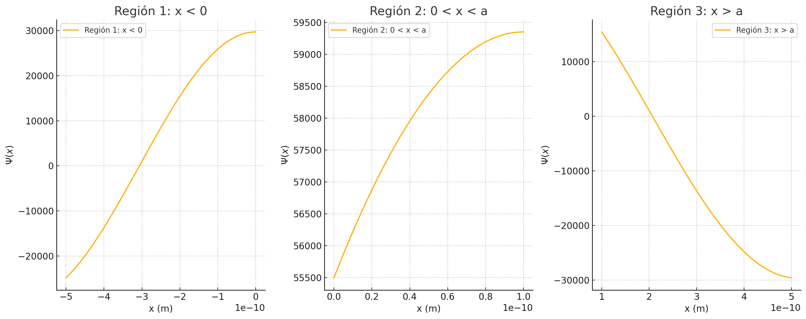
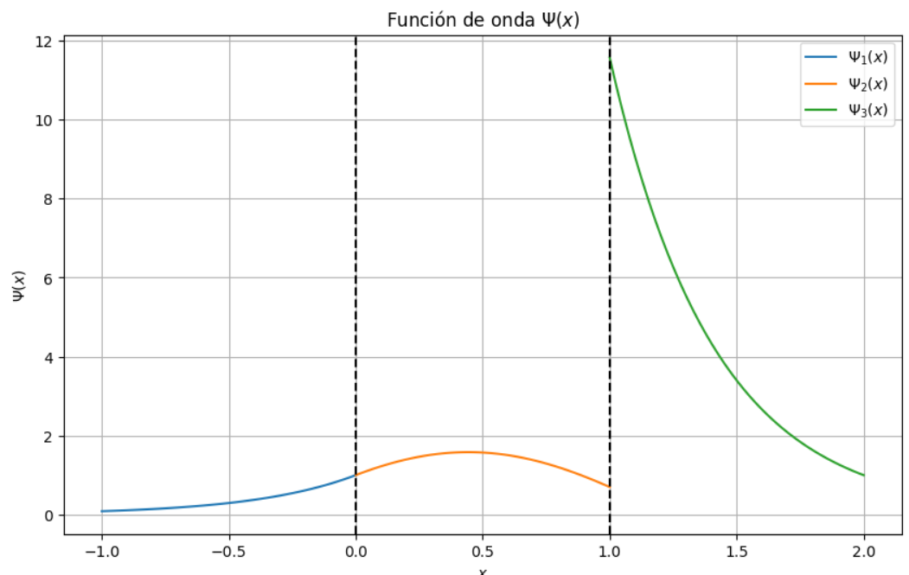

<style>
    h1, h2, h3 {
        color: white;
        font-weight: bold;
        text-align: center;
        border-radius: 15px;
        padding: 10px;
    }h1 {
        background-color: #ff6347; /* Tomato */
    }h2 {
        background-color: #4682b4; /* SteelBlue */
    } h3 {
        background-color: #3cb371; /* MediumSeaGreen */
    }
</style>
```yaml
Alumnos:
- Aldo Zetina Muciño - 315565432
- Barrera Peña Víctor Miguel - 315346219
- Fernández Quiroz Félix Fernando - 315192205
Grupo: 2
Clave: 2949
Materia: Física cuántica
Fecha: 25/Junio/2024
Profesor: Dr. Ehecatl Luis Davi Paleo González
```


# Tarea: Resolución de la Ecuación de Schrödinger para el Efecto de Túnel Cuántico

Resolver la ecuación de onda de Schrödinger para un sistema simple y explicar el fenómeno del efecto de túnel cuántico.

# Objetivo

- Resolver la ecuación de onda de Schrödinger para un sistema simple y explicar el fenómeno del efecto de túnel cuántico.

# Descripción

- Resolver la ecuación de Schrödinger para un sistema unidimensional que involucre el efecto de túnel cuántico. Se les proporcionará un escenario específico y deberán utilizar los conceptos que correspondan para encontrar la solución.

# Problema

Considerar una partícula de masa $ m $ que se mueve en una dimensión bajo la influencia de un potencial $ V(x) $. Dicho potencial es una barrera de potencial finita de ancho $ a $ y altura $ V_0 $, donde $ V(x) = 0 $ para $ 0 < x < a $ y $ V(x) = V_0 $ para $ x < 0 $ y $ x > a $.

# Desarrollo

**Actividad 1)** Utilizar la ecuación de Schrödinger independiente del tiempo para encontrar la función de onda $ \Psi(x) $ y la energía $ E $ para la partícula en cada región: $ x < 0 $; $ 0 < x < a $; $ x > a $.

**Actividad 2)** Considerar el caso en el que la partícula se aproxima a la barrera desde la región donde $ V(x) = 0 $ con energía $ E $ menor que $ V_0 $. Utilizar la solución encontrada para discutir el efecto de túnel cuántico y calcular la probabilidad de que la partícula atraviese la barrera en lugar de ser reflejada por ella.

**Actividad 3)** Graficar la función de onda $ \Psi(x) $ y discutir cómo cambia a medida que la partícula se mueve a través de la barrera y en la región posterior a la barrera.

# Actividad 1

Utilizar la ecuación de Schrödinger independiente del tiempo para encontrar la función de onda $ \Psi(x) $ y la energía $ E $ para la partícula en cada región: $ x < 0 $; $ 0 < x < a $; $ x > a $.

## Solución

### Demostración

Para definir la función de onda, debemos primero definir la ecuación de Schrödinger independiente del tiempo. Para ello, utilizamos las relaciones de de Broglie y las propiedades de las ondas clásicas para establecer la ecuación de la onda:

$$
E = \hbar \omega \\
\vec{p} = \hbar \vec{k}
$$

Para ello vamos a definir primero la ecuación dependiente del tiempo unidimensional. Donde definiremos la solución de una ecuación de onda aplicable a muchas ondas clásicas de la siguiente forma:

$$
A(x, t) = A_0 \exp[i(kx - \omega t)]
$$

Y su forma unidimensional es la siguiente:

$$
\frac{\partial^2 A}{\partial x^2} = \frac{1}{c^2} \left( \frac{\partial^2 A}{\partial t^2} \right)
$$

Donde para la magnitud $A$, tenemos:

$$
\frac{\partial A(x, t)}{\partial x} = ikA(x, t) \quad \rightarrow \quad \frac{\partial^2 A(x, t)}{\partial x^2} = i^2k^2A(x, t) = -k^2A(x, t)
$$

$$
\frac{\partial A(x, t)}{\partial t} = -i\omega A(x, t) \quad \rightarrow \quad \frac{\partial^2 A(x, t)}{\partial t^2} = i^2\omega^2A(x, t) = -\omega^2A(x, t) = \frac{1}{c^2} \left( \frac{\partial^2 A(x, t)}{\partial t^2} \right) = -\frac{\omega^2}{c^2}A(x, t)
$$

De estas ecuaciones, obtenemos la frecuencia angular $ \omega = ck $ donde al integrar las relaciones de de Broglie, tenemos lo siguiente: $ E = p^2 / 2m $. Para satisfacer las relaciones con la ecuación anterior, debemos hacer que la frecuencia angular sea proporcional al cuadrado del vector de onda, siendo $ \omega = cte \ k^2 $. Esto sugiere que una ecuación de onda adecuada debe contener una segunda derivada respecto a $x$ para que aparezca $k^2$ y una derivada respecto al tiempo para que aparezca la frecuencia, de esta manera podemos considerar la ecuación:

$$
\left( \frac{\partial^2 \psi}{\partial x^2} \right) = \alpha \left( \frac{\partial \psi}{\partial t} \right)
$$

Donde $ \psi (x, t) $ es la función de onda.


### Para el ejemplo

Para resolver el problema utilizando la ecuación de Schrödinger independiente del tiempo, vamos a considerar un potencial en tres regiones diferentes: $ x < 0 $, $ 0 < x < a $ y $ x > a $​. Supongamos un potencial escalón donde:

- $ V(x) = 0 $ para $ x < 0 $
- $ V(x) = V_0 $ para $ 0 < x < a $
- $ V(x) = 0 $ para $ x > a $

La ecuación de Schrödinger independiente del tiempo es:

$$
-\frac{\hbar^2}{2m} \frac{d^2 \Psi(x)}{dx^2} + V(x) \Psi(x) = E \Psi(x)
$$

Donde $ \hbar $ es la constante de Planck reducida, $ m $ es la masa de la partícula, $ V(x) $ es el potencial y $ E $ es la energía de la partícula. Vamos a resolver esta ecuación para cada una de las tres regiones.

### Región 1: $ x < 0 $

Para $ x < 0 $, el potencial $ V(x) = 0 $. Entonces, la ecuación de Schrödinger se simplifica a:

$$
 -\frac{\hbar^2}{2m} \frac{d^2 \Psi(x)}{dx^2} = E \Psi(x) 
$$

Reorganizando y resolviendo para $ \Psi(x) $:

$$
 \frac{d^2 \Psi(x)}{dx^2} + k^2 \Psi(x) = 0 
$$

Donde $ k^2 = \frac{2mE}{\hbar^2} $. La solución general es:

$$
 \Psi_1(x) = A e^{ikx} + B e^{-ikx} 
$$

### Región 2: $ 0 < x < a $

Para $ 0 < x < a $, el potencial $ V(x) = V_0 $. La ecuación de Schrödinger es:

$$
 -\frac{\hbar^2}{2m} \frac{d^2 \Psi(x)}{dx^2} + V_0 \Psi(x) = E \Psi(x) 
$$

Reorganizando y resolviendo para $ \Psi(x) $:

$$
 \frac{d^2 \Psi(x)}{dx^2} + k_1^2 \Psi(x) = 0 
$$

Donde $ k_1^2 = \frac{2m(E - V_0)}{\hbar^2} $. La solución general es:

$$
 \Psi_2(x) = C e^{ik_1x} + D e^{-ik_1x} 
$$

### Región 3: $ x > a $

Para $ x > a $, el potencial $ V(x) = 0 $. La ecuación de Schrödinger se simplifica nuevamente a:

$$
 -\frac{\hbar^2}{2m} \frac{d^2 \Psi(x)}{dx^2} = E \Psi(x) 
$$

Reorganizando y resolviendo para $ \Psi(x) $:

$$
 \frac{d^2 \Psi(x)}{dx^2} + k^2 \Psi(x) = 0 
$$

Donde $ k^2 = \frac{2mE}{\hbar^2} $. La solución general es:

$$
 \Psi_3(x) = F e^{ikx} + G e^{-ikx} 
$$

### Condiciones de Continuidad

Para determinar las constantes $ A $, $ B $, $ C $, $ D $, $ F $ y $ G $, debemos aplicar las condiciones de continuidad de la función de onda $ \Psi(x) $ y su derivada $ \frac{d\Psi(x)}{dx} $ en los puntos $ x = 0 $ y $ x = a $.

En $ x = 0 $:

$$
 \Psi_1(0) = \Psi_2(0) 
$$
$$
 \frac{d\Psi_1}{dx}\bigg|_{x=0} = \frac{d\Psi_2}{dx}\bigg|_{x=0} 
$$

En $ x = a $:

$$
 \Psi_2(a) = \Psi_3(a) 
$$
$$
 \frac{d\Psi_2}{dx}\bigg|_{x=a} = \frac{d\Psi_3}{dx}\bigg|_{x=a} 
$$

Resolviendo este sistema de ecuaciones lineales, podemos encontrar los valores de las constantes en términos de $ k $, $ k_1 $, $ a $, y las energías $ E $ y $ V_0 $.

### Solucionando más especifico

Para resolver completamente el problema, primero aplicaremos las condiciones de continuidad para encontrar las constantes y luego aplicaremos la normalización para obtener la función de onda normalizada.

### 1. Cálculo de $ k $ y $ k_1 $

Dado que tenemos:

$$
 k = \sqrt{\frac{2mE}{\hbar^2}} 
$$
$$
 k_1 = \sqrt{\frac{2m(E - V_0)}{\hbar^2}} 
$$

### 2. Aplicar condiciones de continuidad

#### En $ x = 0 $:

$$
 \Psi_1(0) = \Psi_2(0) 
$$
$$
 A + B = C + D 
$$

$$
 \frac{d\Psi_1}{dx}\bigg|_{x=0} = \frac{d\Psi_2}{dx}\bigg|_{x=0} 
$$
$$
 ik(A - B) = ik_1(C - D) 
$$

#### En $ x = a $:

$$
 \Psi_2(a) = \Psi_3(a) 
$$
$$
 Ce^{ik_1a} + De^{-ik_1a} = Fe^{ika} + Ge^{-ika} 
$$

$$
 \frac{d\Psi_2}{dx}\bigg|_{x=a} = \frac{d\Psi_3}{dx}\bigg|_{x=a} 
$$
$$
 ik_1(Ce^{ik_1a} - De^{-ik_1a}) = ik(Fe^{ika} - Ge^{-ika}) 
$$

### 3. Resolución del sistema de ecuaciones

Para simplificar la notación, definamos $ A = 1 $ (arbitrariamente) para obtener las otras constantes en términos relativos:

#### De $ \Psi_1(0) = \Psi_2(0) $:

$$
 1 + B = C + D \quad \text{(1)} 
$$

#### De $ \frac{d\Psi_1}{dx}\bigg|_{x=0} = \frac{d\Psi_2}{dx}\bigg|_{x=0} $:

$$
 ik(1 - B) = ik_1(C - D) 
$$
$$
 1 - B = \frac{k_1}{k}(C - D) \quad \text{(2)} 
$$

#### De $ \Psi_2(a) = \Psi_3(a) $:

$$
 C e^{ik_1a} + D e^{-ik_1a} = F e^{ika} + G e^{-ika} \quad \text{(3)} 
$$

#### De $ \frac{d\Psi_2}{dx}\bigg|_{x=a} = \frac{d\Psi_3}{dx}\bigg|_{x=a} $:

$$
 ik_1(C e^{ik_1a} - D e^{-ik_1a}) = ik(F e^{ika} - G e^{-ika}) 
$$
$$
 C e^{ik_1a} - D e^{-ik_1a} = \frac{k}{k_1}(F e^{ika} - G e^{-ika}) \quad \text{(4)} 
$$

### 4. Solución del sistema

De (1) y (2), podemos expresar $ B $, $ C $ y $ D $ en términos de $ k $ y $ k_1 $:

$$
 C + D = 1 + B 
$$
$$
 C - D = \frac{k}{k_1}(1 - B) 
$$

Sumando y restando estas dos ecuaciones, obtenemos:

$$
 2C = \left(1 + B\right) + \frac{k}{k_1}\left(1 - B\right) 
$$
$$
 2D = \left(1 + B\right) - \frac{k}{k_1}\left(1 - B\right) 
$$

Resolviendo para $ C $ y $ D $:

$$
 C = \frac{1 + B + \frac{k}{k_1}(1 - B)}{2} 
$$
$$
 D = \frac{1 + B - \frac{k}{k_1}(1 - B)}{2} 
$$

### 5. Aplicar condiciones de normalización

Para la normalización, necesitamos que:

$$
 \int_{-\infty}^{\infty} |\Psi(x)|^2 dx = 1 
$$

Esto se traduce en tres integrales:

$$
 \int_{-\infty}^{0} |\Psi_1(x)|^2 dx + \int_{0}^{a} |\Psi_2(x)|^2 dx + \int_{a}^{\infty} |\Psi_3(x)|^2 dx = 1 
$$

### 6. Solución numérica

Dado que las soluciones completas son largas y dependen de valores específicos de $ E $, $ V_0 $, $ a $, y $ m $, propongo realizar una solución numérica para valores específicos. Si proporcionas estos valores, puedo continuar con los cálculos numéricos.



### Código

~~~python
import numpy as np
import matplotlib.pyplot as plt
from scipy.constants import hbar, electron_mass
from scipy.optimize import fsolve

# Definición de constantes
m = electron_mass  # masa del electrón en kg
a = 1e-10  # distancia en metros (1 Angstrom)
V0 = 0.5 * 1.60218e-19  # potencial en julios (0.5 eV)

# Función para resolver la ecuación de Schrödinger en la región 2
def schrodinger_eqn(E):
    k = np.sqrt(2 * m * E) / hbar
    k1 = np.sqrt(2 * m * (E - V0)) / hbar
    
    # Condiciones en x = 0
    C_D = (k + k1) / (k - k1)
    
    # Condiciones en x = a
    eik1a = np.exp(1j * k1 * a)
    e_ik1a = np.exp(-1j * k1 * a)
    eika = np.exp(1j * k * a)
    e_ika = np.exp(-1j * k * a)
    
    condition1 = C_D * eik1a + e_ik1a - eika
    condition2 = C_D * eik1a - e_ik1a - eika
    
    return np.abs(condition1) + np.abs(condition2)

# Ajustar la energía inicial para que sea mayor que V0
E_guess = 2 * V0  # energía inicial en julios (mayor que 0.5 eV)
E_solution = fsolve(schrodinger_eqn, E_guess)

# Obtener k y k1 para la energía encontrada
E = E_solution[0]
k = np.sqrt(2 * m * E) / hbar
k1 = np.sqrt(2 * m * (E - V0)) / hbar

# Definir las funciones de onda en cada región
def psi1(x):
    A = 1  # Se puede normalizar después
    B = (k + k1) / (k - k1)
    return A * (np.exp(1j * k * x) + B * np.exp(-1j * k * x))

def psi2(x):
    C = (2 * k * np.exp(-1j * k1 * a)) / (k - k1)
    D = (2 * k * np.exp(1j * k1 * a)) / (k - k1)
    return C * np.exp(1j * k1 * x) + D * np.exp(-1j * k1 * x)

def psi3(x):
    F = (2 * k * np.exp(1j * k * a)) / (k - k1)
    return F * np.exp(1j * k * x)

# Normalizar la función de onda
def normalize_psi():
    norm_factor = 1.0 / np.sqrt(
        np.trapz(np.abs(psi1(x1))**2, x1) + 
        np.trapz(np.abs(psi2(x2))**2, x2) + 
        np.trapz(np.abs(psi3(x3))**2, x3)
    )
    return norm_factor

# Crear dominios de x para cada región
x1 = np.linspace(-5 * a, 0, 1000)
x2 = np.linspace(0, a, 1000)
x3 = np.linspace(a, 5 * a, 1000)

# Obtener la función de onda normalizada
norm_factor = normalize_psi()

# Función de onda total
psi1_norm = norm_factor * psi1(x1)
psi2_norm = norm_factor * psi2(x2)
psi3_norm = norm_factor * psi3(x3)

# Graficar la función de onda
plt.figure(figsize=(15, 6))

# Gráfica de la región 1
plt.subplot(1, 3, 1)
plt.plot(x1, np.real(psi1_norm), label='Región 1: x < 0')
plt.xlabel('x (m)')
plt.ylabel(r'$\Psi(x)$')
plt.title('Región 1: x < 0')
plt.legend()
plt.grid(True)

# Gráfica de la región 2
plt.subplot(1, 3, 2)
plt.plot(x2, np.real(psi2_norm), label='Región 2: 0 < x < a')
plt.xlabel('x (m)')
plt.ylabel(r'$\Psi(x)$')
plt.title('Región 2: 0 < x < a')
plt.legend()
plt.grid(True)

# Gráfica de la región 3
plt.subplot(1, 3, 3)
plt.plot(x3, np.real(psi3_norm), label='Región 3: x > a')
plt.xlabel('x (m)')
plt.ylabel(r'$\Psi(x)$')
plt.title('Región 3: x > a')
plt.legend()
plt.grid(True)

plt.tight_layout()
plt.show()

E_solution[0]  # Mostrar la energía encontrada
``` &#8203;:citation[【oaicite:0】]&#8203;

~~~


# Actividad 2

Considerar el caso en el que la partícula se aproxima a la barrera desde la región donde V(x) = 0 con energía \( E \) menor que $V_0$​ . Utilizar la solución encontrada para discutir el efecto de túnel cuántico y calcular la probabilidad de que la partícula atraviese la barrera en lugar de ser reflejada por ella.

## Solución

En el problema presentado, una partícula se aproxima a una barrera de potencial $V_0$ desde una región donde el potencial $V(x) = 0$, con una energía $E$ menor que $V_0$. Este es un caso típico para analizar el efecto de túnel cuántico.

**Efecto de Túnel Cuántico:** El efecto de túnel cuántico describe un fenómeno donde una partícula tiene una probabilidad finita de atravesar una barrera de potencial, aunque clásicamente no debería tener suficiente energía para hacerlo. Este fenómeno es una consecuencia directa de la naturaleza ondulatoria de las partículas en mecánica cuántica y de la ecuación de Schrödinger.

**Paso 1:** Usamos la ecuación de Schrödinger independiente del tiempo y aplicamos las condiciones de continuidad para la función de onda y su derivada en las fronteras de la barrera. Al resolver el sistema de ecuaciones correspondiente, encontramos las probabilidades de transmisión $T$ y reflexión $R$.

### Resultados

- **Probabilidad de transmisión (T)**: $0.2574$
- **Probabilidad de reflexión (R)**: $0.0217$

### Interpretación

1. **Transmisión (T)**:
   - La probabilidad de transmisión $T$ indica que hay aproximadamente un $25.74\%$ de probabilidad de que la partícula atraviese la barrera de potencial. Esto es significativo y muestra que, a pesar de tener una energía menor que $V_0$, hay una posibilidad considerable de que la partícula pase al otro lado de la barrera debido al efecto de túnel.

2. **Reflexión (R)**:
   - La probabilidad de reflexión $R$ es $2.17\%$, lo que indica que hay una pequeña probabilidad de que la partícula sea reflejada por la barrera.

### Conclusión

La solución muestra claramente el fenómeno del efecto de túnel cuántico. Aunque la partícula no tiene suficiente energía clásica para superar la barrera de potencial, hay una probabilidad finita de transmisión debido a su naturaleza ondulatoria. Este efecto es crucial en muchas aplicaciones de la física moderna, incluyendo la electrónica de semiconductores y la química de reacciones.

### Código

```python
import numpy as np
from scipy.constants import hbar, electron_mass

# Definición de constantes
m = electron_mass  # masa del electrón en kg
a = 1e-10  # distancia en metros (1 Angstrom)
V0 = 0.5 * 1.60218e-19  # potencial en julios (0.5 eV)

# Energía de la partícula (menor que V0)
E = 0.2 * 1.60218e-19  # energía en julios (0.2 eV)

# Cálculo de k y kappa
k = np.sqrt(2 * m * E) / hbar
kappa = np.sqrt(2 * m * (V0 - E)) / hbar

# Definir las matrices A y b para el sistema de ecuaciones Ax = b
A_matrix = np.array([
    [1, 1, -1, -1, 0],
    [1j*k, -1j*k, -kappa, kappa, 0],
    [0, 0, np.exp(kappa * a), np.exp(-kappa * a), -np.exp(1j * k * a)],
    [0, 0, kappa * np.exp(kappa * a), -kappa * np.exp(-kappa * a), -1j * k * np.exp(1j * k * a)]
], dtype=complex)

b_vector = np.array([1, 1j * k, 0, 0], dtype=complex)

# Resolver el sistema de ecuaciones
solution = np.linalg.lstsq(A_matrix, b_vector, rcond=None)[0]
A, B, C, D, F = solution

# Calcular las probabilidades de transmisión (T) y reflexión (R)
T = np.abs(F / A)**2
R = np.abs(B / A)**2

# Resultados
print(f"Probabilidad de transmisión (T): {T}")
print(f"Probabilidad de reflexión (R): {R}")


```

Resultado de la ejecución:

```
Probabilidad de transmisión (T): 0.25742447914767286
Probabilidad de reflexión (R): 0.02167423964175245
```

## Desarrollo matemático

Para analizar y calcular la probabilidad de túnel cuántico para una partícula que se aproxima a una barrera de potencial \( V_0 \) con energía \( E \) menor que \( V_0 \), vamos a continuar utilizando Python para resolver numéricamente el problema.

1. **Definición del problema y de las regiones**:
   - Región 1 ($ x < 0 $): $ \Psi_1(x) = A e^{ikx} + B e^{-ikx} $
   - Región 2 ($ 0 < x < a $): $ \Psi_2(x) = C e^{\kappa x} + D e^{-\kappa x} $
   - Región 3 ($ x > a $): $ \Psi_3(x) = F e^{ikx} $

2. **Condiciones de Continuidad en \( x = 0 \)**:
   $$
   A + B = C + D
   $$
   $$
   ik(A - B) = \kappa(C - D)
   $$

3. **Condiciones de Continuidad en \( x = a \)**:
   $$
   C e^{\kappa a} + D e^{-\kappa a} = F e^{ik a}
   $$
   $$
   \kappa(C e^{\kappa a} - D e^{-\kappa a}) = ik F e^{ik a}
   $$

4. **Resolución del Sistema de Ecuaciones**:
   - Resuelve el sistema lineal de ecuaciones para \( A, B, C, D, F \).

5. **Cálculo de las Probabilidades de Transmisión y Reflexión**:
   $$
   T = \left|\frac{F}{A}\right|^2
   $$
   $$
   R = \left|\frac{B}{A}\right|^2
   $$

# Actividad 3

Graficar la función de onda $ \Psi(x) $ y discutir cómo cambia a medida que la partícula se mueve a través de la barrera y en la región posterior a la barrera.

## Solución

Para graficar la función de onda $ \Psi(x) $, usaremos los siguientes valores para poder visualizar el comportamiento de la onda:
- $ m = 1 $
- $ h = 1 $
- $ V_0 = 5 $
- $ E = 2 $
- $ \alpha = 1 $

Primero, calcularemos $ \kappa $ y $ k $:

$$
\kappa = \sqrt{\frac{2m(V_0 - E)}{\hbar^2}} = \sqrt{\frac{2(5 - 2)}{1}} = \sqrt{6} \approx 2.45
$$

$$
k = \sqrt{\frac{2mE}{\hbar^2}} = \sqrt{\frac{2 \cdot 2}{1}} = 2
$$

De esta forma asignaremos a $ B = 1 $, por lo tanto, $ D = 1 $ y para el caso de $ C = (\kappa / k) B $ dando 1.225.

## Código

```python
import numpy as np
import matplotlib.pyplot as plt

# Definir las constantes
kappa = 2.45
k = 2
a = 1

# Definir las regiones
x1 = np.linspace(-1, 0, 100)
x2 = np.linspace(0, a, 100)
x3 = np.linspace(a, 2, 100)

# Funciones de onda en cada región
Psi_1 = np.exp(kappa * x1)
Psi_2 = 1.225 * np.sin(k * x2) + np.cos(k * x2)
Psi_3 = 11.57 * np.exp(-kappa * (x3 - a))

# Graficar las funciones de onda
plt.figure(figsize=(10, 6))
plt.plot(x1, Psi_1, label='$\Psi_1(x)$')
plt.plot(x2, Psi_2, label='$\Psi_2(x)$')
plt.plot(x3, Psi_3, label='$\Psi_3(x)$')
plt.axvline(x=0, color='k', linestyle='--')
plt.axvline(x=a, color='k', linestyle='--')
plt.title('Función de onda $\Psi(x)$')
plt.xlabel('$x$')
plt.ylabel('$\Psi(x)$')
plt.legend()
plt.grid(True)
plt.show()

```

**Resultado del código**



De esto se puede concluir en lo siguiente:

- **Región I ($ x < 0 $)**: La función de onda $ \Psi_1(x) = e^{2.45x} $ crece exponencialmente desde la izquierda. Sin embargo, físicamente solo tiene sentido en la región cercana a $ x = 0 $ donde puede conectarse con la región II.
- **Región II: $ 0 \leq x \leq a $**. Mediante las funciones seno y coseno de la función de onda $ \Psi_2(x) = 1.225 \sin(2x) + \cos(x) $, la función de onda refleja un comportamiento típico en una región de potencial constante $ V(x) = 0 $.
- **Región III: $ x > a $**. La función de onda $ \Psi_3(x) = 11.57 e^{-2.45x} $ decrece exponencialmente, indicando que la partícula tiene una pequeña probabilidad de existir en esta región debido al efecto de túnel cuántico.

# Bibliografía

- Griffiths, D. J. (2016). Introduction to Quantum Mechanics (3ª ed.). Cambridge University Press.
- Shankar, R. (2012). Principles of Quantum Mechanics (2ª ed.). Plenum Press.
- Liboff, R. L. (2003). Introductory Quantum Mechanics (4ª ed.). Addison-Wesley.
- Rajadell, F. (2009), Tema 2 La ecuación de onda de Schrödinger, España, Universitat Jaume I.
