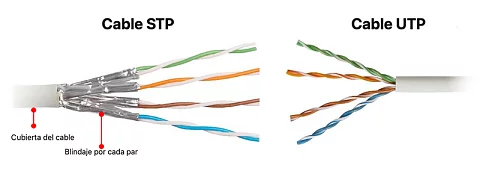
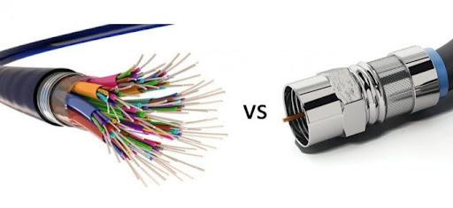
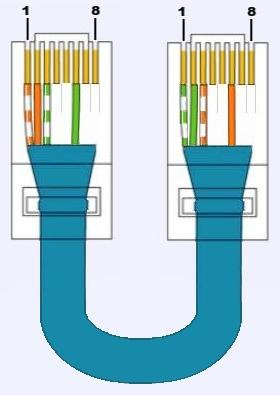
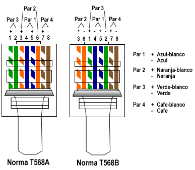

# PRÁCTICA 1:Construcción de cables UTP para conexión directa y cruzada,Cuestionario Previo

# 1) Explique la razón por la cual los alambres del cable UTP están trenzados.

Los alambres del cable UTP (Unshielded Twisted Pair) están trenzados para minimizar la interferencia electromagnética tanto externa como entre los mismos pares del cable. Este fenómeno de interferencia es conocido como crosstalk, y ocurre cuando la señal que transita por un par de cables interfiere con la señal de otro par.

Al trenzar los alambres, se aumenta la cancelación del ruido electromagnético de dos maneras principales:

1. **Cancelación de ruido**: Cuando dos alambres están trenzados entre sí, las interferencias que afectan a uno tienden a afectar también al otro. Dado que las señales se transmiten utilizando la diferencia de voltaje entre los dos alambres del par (transmisión diferencial), cualquier ruido que se induzca en ambos alambres por igual no cambiará la diferencia de voltaje y por lo tanto se cancelará.

2. **Reducción del crosstalk**: El trenzado también asegura que cada uno de los alambres esté igualmente expuesto a cualquier posible fuente de interferencia externa. Esto es importante porque si un alambre de un par está más cerca de un alambre de otro par, podría inducir una señal en él. Al trenzarlos, se cambia constantemente la proximidad relativa de los alambres con respecto a los otros pares en el cable, lo que ayuda a igualar las condiciones de exposición a la interferencia y reduce el crosstalk.

Además, cada par dentro de un cable UTP tiene un número diferente de trenzas por metro para minimizar la posibilidad de que dos pares tengan la misma frecuencia de crosstalk, lo que proporciona una protección adicional contra este tipo de interferencia.

# 2) ¿Qué es un par trenzado: UTP (Unshielded Twisted Pair) cable par trenzado no blindado (no apantallado)? Explique las características así como ventajas y desventajas.

El par trenzado UTP es un tipo de cableado que se utiliza comúnmente para las redes de telecomunicaciones y es el tipo de cable más común en redes de área local (LANs). Como su nombre lo indica, consiste en pares de alambres que están trenzados juntos y no tiene una pantalla o blindaje adicional alrededor de estos pares.

**Características del cable UTP:**
- **Estructura**: Compuesto por 4 pares de alambres de cobre, cada par está trenzado para proteger contra las interferencias electromagnéticas.
- **Colores estándar**: Los pares siguen un código de colores estándar para facilitar la identificación y la conexión.
- **Flexibilidad**: Es más flexible que los cables blindados, lo que facilita su instalación en espacios reducidos o con muchas curvas.
- **Categorías**: Existen diferentes categorías (Cat 5e, Cat 6, Cat 6a, etc.) que soportan diferentes rangos de frecuencia y velocidades de transmisión.
- **Conectores**: Generalmente utiliza conectores RJ-45 para conectar en equipos de red.

**Ventajas del cable UTP:**
- **Costo**: Es más económico que los cables blindados (STP) o la fibra óptica.
- **Instalación**: Más fácil y rápido de instalar debido a su flexibilidad y porque no requiere herramientas especiales para su instalación.
- **Manejabilidad**: Su ligereza y flexibilidad lo hacen adecuado para una variedad de entornos de instalación.
- **Mantenimiento**: Es relativamente fácil de mantener y los problemas suelen ser fáciles de solucionar.

**Desventajas del cable UTP:**
- **Susceptibilidad a interferencias**: Al no tener blindaje, es más susceptible a las interferencias electromagnéticas y al ruido, lo que puede reducir la calidad de la señal.
- **Distancia**: La señal puede degradarse a distancias mayores en comparación con otros medios como la fibra óptica; generalmente, se limita a 100 metros para aplicaciones de red.
- **Ancho de banda**: Aunque las categorías superiores de UTP soportan velocidades de red más altas, no alcanzan las capacidades de la fibra óptica.
- **Seguridad**: Puede ser más vulnerable a las escuchas clandestinas que los cables blindados o la fibra óptica.

# 3) ¿Qué es un par trenzado: STP (Shielded Twisted Pair) cable de par trenzado blindado (apantallado)? Explique las características así como ventajas y desventajas.

El par trenzado STP (Shielded Twisted Pair) es un tipo de cableado que se utiliza en redes de telecomunicaciones y que, al igual que el UTP, consiste en pares de alambres de cobre trenzados. La diferencia principal es que el STP incluye un blindaje o pantalla adicional que proporciona una capa extra de protección contra las interferencias electromagnéticas.

**Características del cable STP:**
- **Blindaje**: Además de los pares trenzados, el STP tiene un blindaje que puede ser global, cubriendo todos los pares juntos, o individual, donde cada par tiene su propio blindaje.
- **Conectividad**: Utiliza conectores RJ-45, al igual que el UTP, pero los conectores deben estar diseñados para acomodar el grosor adicional del blindaje.
- **Construcción**: Puede ser más rígido debido al blindaje, lo que puede hacer que la instalación sea un poco más desafiante en comparación con el UTP.
- **Categorías**: Al igual que el UTP, viene en diferentes categorías que se adaptan a diferentes necesidades de ancho de banda y velocidad de transmisión.

**Ventajas del cable STP:**
- **Protección contra interferencias**: Ofrece una mejor protección contra la interferencia electromagnética y el ruido de radiofrecuencia, lo que lo hace ideal para entornos ruidosos.
- **Calidad de señal**: La calidad de la señal se mantiene mejor a lo largo del cable, lo que puede permitir distancias de transmisión ligeramente mayores sin pérdida de señal.
- **Reducción de errores**: La interferencia reducida puede llevar a una menor tasa de errores de bits en la transmisión de datos.

**Desventajas del cable STP:**
- **Costo**: Es más caro que el UTP debido a la protección adicional.
- **Instalación**: El blindaje hace que el cable sea más grueso y menos flexible, lo que puede complicar la instalación, especialmente en espacios reducidos o con muchas curvas.
- **Peso**: Es más pesado que el UTP, lo que puede ser un factor a considerar en el tendido de cables aéreos o en grandes cantidades.
- **Tierra**: El blindaje debe ser conectado a tierra adecuadamente para ser efectivo, lo que requiere una consideración adicional durante la instalación.
- **Conectividad**: Los conectores y los paneles de parcheo deben ser compatibles con STP, lo que puede limitar las opciones o aumentar el costo.

El cable STP es una buena elección para entornos con alta interferencia electromagnética o para aplicaciones que requieren una mejor protección de la señal.

# 4) Mencione las categorías de cables UTP que existen. Explique más a detalle las principales aplicaciones de los cables de la categoría UTP 5e (5 enhance - mejorada) y UTP 6.

| Categoría | Ancho de Banda | Velocidad de Transmisión         | Distancia Máxima | Año de Implementación |
| --------- | -------------- | -------------------------------- | ---------------- | --------------------- |
| Cat 3     | Hasta 16 MHz   | 10 Mbps                          | 100 metros       | 1990                  |
| Cat 5     | Hasta 100 MHz  | 100 Mbps                         | 100 metros       | 1995                  |
| Cat 5e    | Hasta 100 MHz  | 1 Gbps                           | 100 metros       | 2001                  |
| Cat 6     | Hasta 250 MHz  | 1 Gbps (10 Gbps hasta 55 metros) | 100 metros       | 2002                  |
| Cat 6a    | Hasta 500 MHz  | 10 Gbps                          | 100 metros       | 2008                  |
| Cat 7     | Hasta 600 MHz  | 10 Gbps                          | 100 metros       | 2010                  |
| Cat 7a    | Hasta 1000 MHz | 10 Gbps                          | 100 metros       | Después de 2010       |
| Cat 8     | Hasta 2000 MHz | 25/40 Gbps                       | 30 metros        | Después de 2013       |

# 5) ¿Qué categoría de cable UTP es conveniente utilizar en nuevas instalaciones de cableado y por qué?

La elección de la categoría de cable UTP adecuada para nuevas instalaciones de cableado depende de varios factores, incluyendo el presupuesto, el ancho de banda requerido y la previsión para futuras actualizaciones de red. A continuación, se presentan algunas consideraciones generales:

Para la mayoría de las nuevas instalaciones, **Cat 6a** es a menudo la recomendación estándar. Ofrece un buen equilibrio entre rendimiento y costo, proporciona un margen de rendimiento suficiente para futuras actualizaciones, y es compatible con todas las aplicaciones Ethernet actuales. Además, el uso de Cat 6a puede ayudar a asegurar que la infraestructura de cableado no necesite ser reemplazada o actualizada en el corto a medio plazo a medida que aumentan las demandas de ancho de banda. Sin embargo, para redes domésticas o de pequeñas empresas donde las demandas de ancho de banda son moderadas y el presupuesto es una consideración importante, Cat 5e o Cat 6 podrían ser opciones completamente adecuadas. Si el presupuesto es mayor o el requerimiento, entonces se opta por un categoría 7 o 8.

#  6) Mencione las características de otros medios de transmisión: el cable coaxial y la fibra óptica.

| Característica        | Cable Coaxial                                                | Fibra Óptica                                                 |
| --------------------- | ------------------------------------------------------------ | ------------------------------------------------------------ |
| Material              | Conductor central de cobre rodeado por un aislante y blindaje | Hilos de vidrio o plástico que transportan luz               |
| Método de Transmisión | Señales eléctricas                                           | Señales de luz                                               |
| Ancho de Banda        | Menor comparado con la fibra óptica                          | Muy alto, puede transportar grandes cantidades de datos      |
| Velocidad             | Hasta cientos de Mbps                                        | Hasta cientos de Gbps                                        |
| Distancia             | Limitado, señal se degrada más rápidamente, típicamente hasta 100 metros | Largas distancias, más de 100 km sin necesidad de repetidores |
| Interferencia         | Susceptible a interferencias electromagnéticas y ruido de radiofrecuencia | Inmune a interferencias electromagnéticas; muy bajo índice de error |
| Seguridad             | Vulnerable a las escuchas; el blindaje ayuda pero puede ser comprometido | Muy segura, casi imposible de interceptar sin dañar la señal |
| Instalación           | Relativamente fácil y de bajo costo                          | Más difícil y costosa debido a la necesidad de equipos especiales y habilidades técnicas |
| Mantenimiento         | Fácil de reparar y conectar                                  | Difícil de reparar; requiere empalmes especializados         |
| Aplicaciones          | Televisión por cable, Internet de banda ancha, redes de área local (antiguas) | Telecomunicaciones, redes de área amplia, transmisión de datos de alta velocidad, redes de cableado estructurado |

La fibra óptica y el cable coaxial se muestran en las siguientes imágenes:

# 7) Si se va a tender un cable que transmita voz a través de cable UTP ¿Qué pines se utilizarían, cómo se armaría?

Para transmitir voz a través de un cable UTP utilizando el estándar de telefonía común, normalmente se emplea el esquema de cableado T568A o T568B. La telefonía analógica tradicional requiere solo un par de cables para funcionar, utilizando las posiciones del conector RJ45 que corresponden a los pines 4 y 5 para el estándar T568A o los pines 3 y 6 para el T568B.

**Para un cable de teléfono estándar RJ11 utilizando cable UTP:**

- Se utilizan los pines centrales del conector RJ11, que son para 2 hilos, y si el teléfono usa 4 hilos, entonces se utilizarían los pines 2, 3, 4 y 5.
- Para conectar un RJ11 a un conector RJ45, los pines 4 y 5 del RJ45 se usarían para los pines centrales del RJ11.

# 8) Investigue la configuración para un cable cruzado en redes de tipo Gigabit Ethernet

Para redes Gigabit Ethernet (1000Base-T), un cable cruzado se usa tradicionalmente para conectar dos dispositivos de red del mismo tipo, como dos computadoras sin un switch o hub entre ellas, aunque la mayoría de los dispositivos de red modernos soportan la capacidad de auto-MDI/MDI-X, lo que elimina la necesidad de cables cruzados.

El cable cruzado para Gigabit Ethernet se configura cruzando los pares de transmisión y recepción de cables dentro del conector RJ-45, permitiendo que un dispositivo envíe señales a los pines de recepción del otro dispositivo y viceversa. A continuación, se muestra la configuración de los pines para un cable cruzado según los estándares T568A y T568B:

**Un extremo del cable (T568A):**

1. Blanco/Verde
2. Verde
3. Blanco/Naranja
4. Azul
5. Blanco/Azul
6. Naranja
7. Blanco/Marrón
8. Marrón

**El otro extremo del cable (T568B):**
1. Blanco/Naranja
2. Naranja
3. Blanco/Verde
4. Azul
5. Blanco/Azul
6. Verde
7. Blanco/Marrón
8. Marrón

Los pares cruzados en este caso son el par 2 (pines 1 y 2) y el par 3 (pines 3 y 6), que son los pares utilizados para la transmisión y recepción en Fast Ethernet (100Base-TX). Aunque para Gigabit Ethernet todos los pares se utilizan tanto para la transmisión como para la recepción, la práctica de cruzar estos pares se mantiene para la compatibilidad con los estándares más antiguos.

Es importante tener en cuenta que para las conexiones Gigabit y superiores, el uso de cables cruzados es cada vez menos frecuente debido a la función auto-MDI/MDI-X mencionada anteriormente, que permite que los dispositivos ajusten automáticamente la configuración de los pines para la comunicación, sin importar si se está utilizando un cable directo o cruzado.

# 9) ¿Qué significan las normas ANSI/EIA/TIA T568-A y ANSI/EIA/TIA T568-B?

Las normas ANSI/EIA/TIA T568-A y T568-B son estándares técnicos que especifican cómo deben ser ordenados los cables en los conectores RJ-45 para la terminación de cables de red en aplicaciones de telecomunicaciones. Estas normas fueron desarrolladas por la Asociación de Industrias de Telecomunicaciones (TIA) y el Instituto Americano de Estándares Nacionales (ANSI) en colaboración con la Asociación de Industrias Electrónicas (EIA).

### ANSI/EIA/TIA T568-A

La norma T568-A establece un esquema de cableado para terminar cables de red. Es uno de los dos patrones de cableado reconocidos y ampliamente utilizados para cables de par trenzado en redes Ethernet y otros tipos de redes de área local, sistemas de telefonía y otras aplicaciones de telecomunicaciones. La disposición de los cables según T568-A es la siguiente, partiendo desde el pin 1: blanco/verde, verde, blanco/naranja, azul, blanco/azul, naranja, blanco/marrón, marrón.

### ANSI/EIA/TIA T568-B

La norma T568-B es otro esquema de cableado y es el más comúnmente utilizado en aplicaciones de red. La diferencia principal entre T568-A y T568-B es el intercambio de las posiciones de los pares de cables verde y naranja. La configuración de T568-B es: blanco/naranja, naranja, blanco/verde, azul, blanco/azul, verde, blanco/marrón, marrón.

**Diferencia**

Las normas ANSI/EIA/TIA T568-A y T568-B son estándares clave en la industria de las telecomunicaciones para la terminación de cables de red con conectores RJ-45. Estos estándares especifican el orden de los cables dentro de los conectores, lo que es crucial para la interoperabilidad y el funcionamiento eficiente de las redes.

La principal diferencia entre T568-A y T568-B reside en la posición de los pares de cables naranja y verde. En el T568-A, el par verde se coloca en las posiciones 1 y 2, mientras que el par naranja se ubica en las posiciones 3 y 6. En cambio, en el T568-B, el par naranja ocupa las posiciones 1 y 2, y el par verde las posiciones 3 y 6.

En la práctica, la elección entre T568A y T568B puede depender de factores como la compatibilidad con infraestructuras existentes o requisitos específicos de ciertos clientes o contratos, especialmente en el ámbito gubernamental de Estados Unidos donde se ha podido preferir T568A en el pasado.

# 10) ¿Cuál es la importancia de la capa 1 del modelo OSI?

La importancia de la capa 1 del modelo OSI (capa física) :

1. **Gestiona conexiones físicas** entre dispositivos, incluyendo el hardware necesario como cables y conectores.
2. **Transmite bits crudos** a través del medio de comunicación, convirtiendo los datos digitales en señales eléctricas o de luz.
3. **Maneja la activación y desactivación** de las conexiones físicas para comenzar o terminar la transmisión de datos.
4. **Convierte las señales** para que los datos puedan ser enviados y recibidos entre dispositivos.
5. **Define la topología de red**, es decir, cómo están dispuestos y conectados los dispositivos dentro de la red.
6. **Soporta múltiples tipos de medios de transmisión**, adaptándose a diferentes entornos de red y requisitos de transmisión.
7. **Establece parámetros de transmisión** como velocidad, voltaje, y sincronización para asegurar la correcta interpretación de las señales.

# 11) Investigue costos del cable UTP categorías 5e, 6 y 6a.

Los precios son de cables comerciales de 1 metro ponchado, en Amazon y mercadoLibre.

| Categoría de Cable | Precio (pesos) |
| ------------------ | -------------- |
| Cat 5              | 50             |
| Cat 6              | 110            |
| Cat 6a             | 125            |
| Cat 7              | 199            |
| Cat 8              | 239            |

# Referencias

- Beyondtech. (n.d.). *What’s the difference between T568A and T568B standards?* Recuperado el 05 de febrero de 2024, de https://beyondtech.us

- Comunidad FS. (2021, julio 15). *T568A y T568B: dos estándares de cable de red RJ45*. Recuperado el 05 de febrero de 2024, de https://community.fs.com/es

- GHIA. (n.d.). *Cable de Red GHIA Cat5e UTP RJ-45 100% Cobre 1mts Color Azul*. MercadoLibre México. Recuperado el 5 de febrero de 2024, de [https://www.mercadolibre.com.mx/cable-de-red-ghia-cat5e-utp-rj-45-100-cobre-1mts-color-azul/p/MLM27039348#searchVariation=MLM27039348&position=8&search_layout=grid&type=product&tracking_id=07421c8f-a2fd-413c-a4f0-d407311aeb0c](https://www.mercadolibre.com.mx/cable-de-red-ghia-cat5e-utp-rj-45-100-cobre-1mts-color-azul/p/MLM27039348#searchVariation=MLM27039348&position=8&search_layout=grid&type=product&tracking_id=07421c8f-a2fd-413c-a4f0-d407311aeb0c)

- OpenAI. (2023). *GPT-4: OpenAI's Latest Language Model*. Recuperado el 05 de febrero de 2024.

- Soporte LAN. (2022, junio 11). *Diferencia entre T568A y T568B*. Recuperado el 05 de febrero de 2024, de https://soportelan.com

- UGREEN. (n.d.). *UGREEN Cable de Red Ethernet Cat 7, Cable RJ45 de Nylon Trenzado de Alta Velocidad 10Gbps 600MHz/s con Conector RJ45, Compatible con Router, Modem, Panel de Conexión, PC, y más (1 Metro)*. Amazon México. Recuperado el 5 de febrero de 2024, de [https://www.amazon.com.mx/UGREEN-Ethernet-Trenzado-Conector-Compatible/dp/B08F4WBX39/ref=sr_1_28?__mk_es_MX=%C3%85M%C3%85%C5%BD%C3%95%C3%91&crid=F9C1Z18UDMZH&keywords=cable+5e&qid=1707199245&sprefix=cable+5e%2Caps%2C134&sr=8-28&ufe=app_do%3Aamzn1.fos.4e545b5e-1d45-498b-8193-a253464ffa47](https://www.amazon.com.mx/UGREEN-Ethernet-Trenzado-Conector-Compatible/dp/B08F4WBX39/ref=sr_1_28?__mk_es_MX=%C3%85M%C3%85%C5%BD%C3%95%C3%91&crid=F9C1Z18UDMZH&keywords=cable+5e&qid=1707199245&sprefix=cable+5e%2Caps%2C134&sr=8-28&ufe=app_do%3Aamzn1.fos.4e545b5e-1d45-498b-8193-a253464ffa47)

