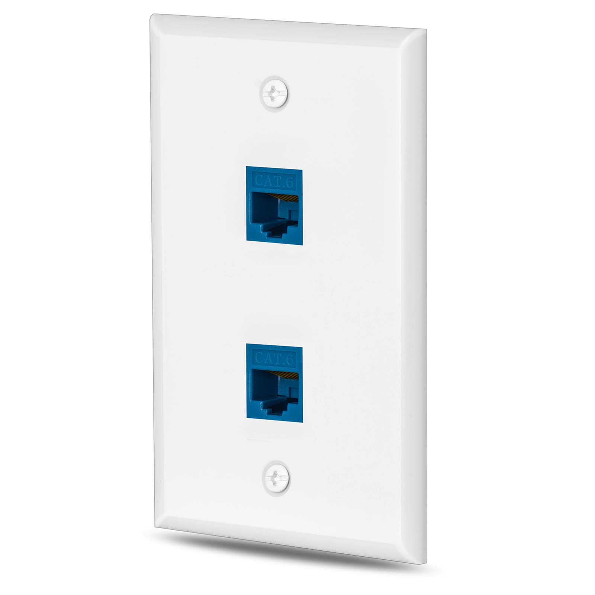

<style>
    h1 {
        background-color: red;
        color: white; /* Para mejorar la legibilidad */
        font-size: 16px;
        text-align: center;
        border: 1px solid black; /* Contorno negro */
        padding: 5px; /* Espaciado interno para que se vea mejor */
    }
</style>

```
# PRÁCTICA 2
# Componentes del cableado estructurado Norma ANSI/EIA/TIA 568
# Cuestionario Previo
```

# 1. ¿Cuál es la función de las siguientes organizaciones: ANSI, EIA y TIA?


| Organización | Función                                                      |
| ------------ | ------------------------------------------------------------ |
| ANSI         | Supervisa la creación de normas para productos y servicios de red, asegurando la interoperabilidad y calidad en EE. UU. |
| EIA          | Desarrollaba estándares para la electrónica y telecomunicaciones; sus estándares siguen en uso a pesar de su disolución. |
| TIA          | Produce estándares para infraestructura de telecomunicaciones, incluyendo el cableado estructurado en entornos comerciales. |

# 2. Mencione las características de los seis subsistemas funcionales que conforman el cableado estructurado.


| Subsistema                                                   | Características                                              |
| ------------------------------------------------------------ | ------------------------------------------------------------ |
| Área de trabajo                                              | Incluye los componentes que extienden desde la toma de telecomunicaciones hasta el equipo del usuario final. |
| Cableado horizontal                                          | Se refiere al cableado que va desde el panel de parcheo hasta las tomas de telecomunicaciones en el área de trabajo. |
| Cuarto de telecomunicaciones / Armario de telecomunicaciones | Espacio centralizado donde se termina el cableado horizontal y se aloja el equipo de telecomunicaciones. |
| Cableado de backbone (vertical)                              | Interconecta los cuartos de telecomunicaciones, las salas de equipos y las entradas de servicios en un edificio o entre edificios. |
| Sala de equipos                                              | Ubicación centralizada para el equipo de telecomunicaciones que sirve a los ocupantes del edificio. |
| Entrada de servicios                                         | Punto en el que el cableado externo se encuentra con el cableado del edificio y se conecta al backbone vertical. |

# 3. ¿Qué es un panel de parcheo?

Un panel de parcheo es un elemento pasivo de la infraestructura de la red que centraliza cables en un único punto para facilitar la gestión y organización de las conexiones de red. Estos paneles vienen equipados con múltiples puertos, a los cuales se conectan los cables que vienen de diferentes equipos o áreas de trabajo. La función principal del panel de parcheo es la de proveer un punto de conexión física para varios dispositivos de red, como computadoras, switches y servidores, permitiendo así la reconfiguración de las conexiones sin necesidad de alterar el cableado estructural.
El uso de paneles de parcheo es crítico en entornos que requieren un alto grado de flexibilidad, como centros de datos o armarios de telecomunicaciones, donde se necesita una organización clara para facilitar el mantenimiento, el diagnóstico de problemas y la expansión del sistema. La eficiencia en la gestión del cableado que proporcionan los paneles de parcheo contribuye a la integridad y al rendimiento óptimo de la infraestructura de red.


# 4. ¿Qué es un rack?

Un rack es una estructura metálica diseñada para organizar, sostener y proteger diversos dispositivos tecnológicos como servidores, switches, routers y otros componentes de red. Su configuración modular y estandarizada permite apilar de manera segura y eficiente el equipo de hardware en entornos donde el espacio es un recurso crítico, como los centros de datos. Gracias a su diseño, facilita el acceso para el mantenimiento, la ventilación y la gestión del cableado, manteniendo la operatividad y el rendimiento del equipo alojado.

Los racks son fundamentales en la industria de la tecnología de la información debido a su capacidad para maximizar el espacio y organizar la infraestructura de red. Además, están diseñados para soportar requisitos específicos de refrigeración y acceso, asegurando así la longevidad y la eficiencia de los componentes críticos. Su uso no se limita a entornos corporativos o de investigación; también se encuentran en el ámbito del entretenimiento profesional, donde se utilizan para albergar equipos de audio y amplificación.

*   **Armazón**: Un rack es una estructura metálica diseñada para sostener dispositivos tecnológicos.
*   **Uso común**: Los racks se utilizan en entornos que requieren agrupar múltiples equipos, como centros de datos en instituciones educativas, científicas, gubernamentales o grandes empresas.
*   **En centros de datos**: Alojan numerosos servidores y requieren una organización cuidadosa de los cables.
*   **Aprovechamiento del espacio**: Permiten ordenar y acceder a múltiples dispositivos en un espacio limitado.
*   **Instalación y mantenimiento**: Requieren una red de cableado compleja y una instalación segura para evitar daños.
*   **Refrigeración**: Esencial para prevenir el sobrecalentamiento, especialmente en racks que funcionan continuamente.
*   **Limpieza**: Fundamental para mantener la efectividad de los ventiladores y evitar la acumulación de polvo.
*   **Unidad rack**: Medida estándar para la altura de equipos montados en racks de entre 19 y 23 pulgadas de ancho.
*   **Amp rack**: Estructura específica para amplificadores en el ámbito musical.
*   **Variedad**: Existen diversos modelos y diseños de racks que se adaptan a las necesidades específicas, algunos parecen muebles domésticos y otros cajas de seguridad, a menudo con puertas de vidrio para observar el interior sin exponer los equipos al polvo.


# 5. ¿Qué es un jack?

En el contexto de redes, un jack se refiere a un conector de pared, también conocido como toma de telecomunicaciones o outlet. Es el punto final donde se conectan los cables de red que vienen del cableado horizontal. Aquí es donde los dispositivos finales, como computadoras, teléfonos o impresoras, se conectan a la red a través de un cable de parcheo.

Las características de un jack de red incluyen:

- **Tipo de Conector**: Comúnmente son RJ45, que es el estándar para conexiones Ethernet.
- **Acoplamiento**: El jack se empareja con un enchufe (plug) en el extremo de un cable de parcheo.
- **Categorización**: Pueden estar categorizados (como Cat5e, Cat6, Cat6a), que indica el tipo de cableado de red que soportan y la velocidad máxima de la conexión.
- **Montaje**: Suelen estar montados en la pared o en paneles de parcheo.
- **Punto de Acceso**: Proporcionan un punto de acceso a la red para los dispositivos.
- **Estándares de Cableado**: Cumplen con los estándares de cableado estructurado como TIA/EIA-568 para garantizar una correcta transmisión de datos. 


# 6. ¿Qué es una roseta?

En el contexto de redes de cableado estructurado, una roseta, también conocida como faceplate o placa de salida, es el elemento al que se monta uno o varios jacks de red. La roseta se instala generalmente en la pared, en el suelo o en el mobiliario de oficina y sirve como punto de terminación física y estética para las conexiones de red.

Las características de una roseta incluyen:

- **Punto de Conexión**: Ofrece uno o más puntos de conexión para dispositivos mediante jacks, como RJ45 para conexiones Ethernet.
- **Integración**: Se integra en la infraestructura del edificio de manera discreta y accesible para los usuarios.
- **Estética**: Están diseñadas para encajar con la decoración interior y suelen estar disponibles en diferentes estilos y colores.
- **Protección**: Protegen las conexiones de factores ambientales y del desgaste, manteniendo los jacks en su lugar y minimizando el riesgo de daños.
- **Marcado y Organización**: Permiten marcar y organizar los puntos de conexión, facilitando la identificación y el mantenimiento de la red.


# 7. ¿Qué es una placa de pared y cuál es su utilidad?

En el ámbito de las redes de cableado estructurado, una placa de pared es un accesorio que se instala sobre o dentro de la pared, en el cual se montan los jacks o conectores de red. La placa de pared cumple varias funciones clave:

- **Soporte para Conectores**: Proporciona un punto fijo donde se pueden instalar uno o más jacks de red (como RJ45 para Ethernet).
- **Punto de Terminación**: Actúa como punto de terminación para el cableado horizontal que viene desde el panel de parcheo o cuarto de telecomunicaciones.
- **Estética y Protección**: Ofrece una solución estética que se integra con la decoración interior, protegiendo al mismo tiempo los conectores y el cableado de posibles daños físicos.
- **Accesibilidad**: Facilita el acceso a los puntos de conexión para el usuario final, permitiendo conectar dispositivos como computadoras, teléfonos y otros equipos de red.
- **Organización del Cableado**: Contribuye a la gestión y organización del cableado dentro del espacio de trabajo, evitando el desorden y posibles confusiones al conectar los equipos.



# 8. ¿Qué es un patch cord y cuál es su objetivo principal?

En el contexto de redes de cableado estructurado, un patch cord (también conocido como cable de parcheo o cable de conexión) es un cable que se utiliza para conectar dispositivos de red entre sí o para conectar dispositivos a puertos en un panel de parcheo, switch, o router. Los patch cords son fundamentales en la infraestructura de redes y tienen características específicas:

**Objetivo principal:**  

	- En términos prácticos es un cable de red de corta distancia con pares  trenzados de cobre equivalentes al del resto de la red pero con 2 puntas de cada extremo terminadas con conectores tipo RJ45.
	- Proporcionar una conexión temporal o permanente entre dispositivos de red o entre dispositivos y la infraestructura de red. Permiten la flexibilidad y la facilidad de gestión en la red, facilitando el reordenamiento de conexiones, pruebas, y la conexión de dispositivos finales a la red.

- **Flexibilidad**: Son flexibles y vienen en varias longitudes para adaptarse a diferentes necesidades de conexión.
- **Conectores**: Tienen conectores en ambos extremos, comúnmente RJ45 para redes Ethernet, aunque pueden variar según el tipo de red (como fibra óptica, donde se usarían conectores LC, SC, etc.).
- **Categorías**: Están disponibles en diferentes categorías (como Cat5e, Cat6, Cat6a, Cat7) que soportan distintas velocidades de transmisión y anchos de banda.


# 9. Investigue costos de patch panels, placas de pared y pinzas de impacto

Las 3 están investigadas en Amazon para tener un precio de similar costo, y en este caso es de la misma marca TRENDnet y para categoría 6.


# 10. Realice un diagrama mostrando la trayectoria de conexiones desde el equipo de cómputo en el área de trabajo hasta el equipo activo ubicado en el cuarto de telecomunicaciones. Haga uso de los elementos que indica el cableado estructurado (rosetas, canaletas, rack, panel de parcheo, etcétera).

## Explicación:

1. **Equipo de Cómputo**: El inicio de la conexión comienza en el equipo de cómputo, como puede ser una computadora de escritorio o un portátil, ubicado en el área de trabajo.

2. **Patch Cord**: Desde el equipo de cómputo, se utiliza un patch cord (cable de parcheo) para conectar el equipo a la roseta o placa de pared más cercana. Este cable suele ser un Ethernet RJ45 que facilita la conexión física a la red.

3. **Roseta o Placa de Pared**: La roseta, montada en la pared, sirve como el punto de terminación del cableado horizontal que viene del cuarto de telecomunicaciones. En ella, el patch cord del equipo de cómputo se conecta a uno de los jacks disponibles.

4. **Cableado Horizontal**: El cableado horizontal se refiere al conjunto de cables que se extiende desde las rosetas en el área de trabajo hasta el cuarto de telecomunicaciones. Este cableado suele estar oculto dentro de canaletas o bajo el suelo para proteger los cables y mantener el orden.

5. **Canaletas**: Las canaletas son conductos utilizados para proteger y organizar el cableado horizontal a medida que transita desde el área de trabajo hasta el cuarto de telecomunicaciones. Permiten una instalación limpia y facilitan el mantenimiento y las futuras expansiones de la red.

6. **Cuarto de Telecomunicaciones**: Al llegar al cuarto de telecomunicaciones, el cableado horizontal se conecta a un panel de parcheo.

7. **Panel de Parcheo**: El panel de parcheo sirve como el punto de consolidación donde se terminan los cables horizontales. Proporciona una interfaz organizada para la conexión de los cables con el equipo activo.

8. **Patch Cords en el Cuarto de Telecomunicaciones**: Se utilizan patch cords adicionales dentro del cuarto de telecomunicaciones para conectar los puertos correspondientes en el panel de parcheo al equipo activo, como switches o routers.

9. **Equipo Activo**: Finalmente, el switch o router, que está montado en un rack dentro del cuarto de telecomunicaciones, recibe la conexión. Este equipo activo es responsable de gestionar y dirigir el tráfico de datos dentro de la red y hacia otras redes.


# Referencias

- OpenAI. (2023). GPT-4.0 [Versión de software]. https://openai.com
- Sanchez, D. (2021, 12 de junio). ¿Qué es un Cable de Parcheo o Patch Cord en Redes? ITA TECH. https://info.ita.tech/blog/que-es-un-cable-de-parcheo-patch-panel
- Pérez Porto, J., & Gardey, A. (2022, 28 de noviembre). Rack - Qué es, definición y concepto. Definición.de. https://definicion.de/rack/
- TRENDnet. (n.d.). TRENDnet TC-PDT Herramienta de Impacto . Amazon. Recuperado el 13 de febrero del 2024, de https://www.amazon.com.mx/TRENDnet-TC-PDT-Perforadora/dp/B0000AZK4D/
- TRENDnet. (n.d.). TRENDnet TC-PDT Herramienta de Impacto. Amazon. Recuperado el el 13 de febrero del 2024, de https://www.amazon.com.mx/TRENDnet-TC-PDT-Perforadora/dp/B0000AZK4D/
- TRENDnet. (n.d.). TRENDnet TC-P24C6 Unshielded Wallmount Rackmount Patch Panel, 24-Port CAT 6, 19" Rackmount . Amazon. Recuperado el el 13 de febrero del 2024, de https://www.amazon.com.mx/TRENDnet-Unshielded-Wallmount-Rackmount-TC-P24C6/dp/B0000AZK72/